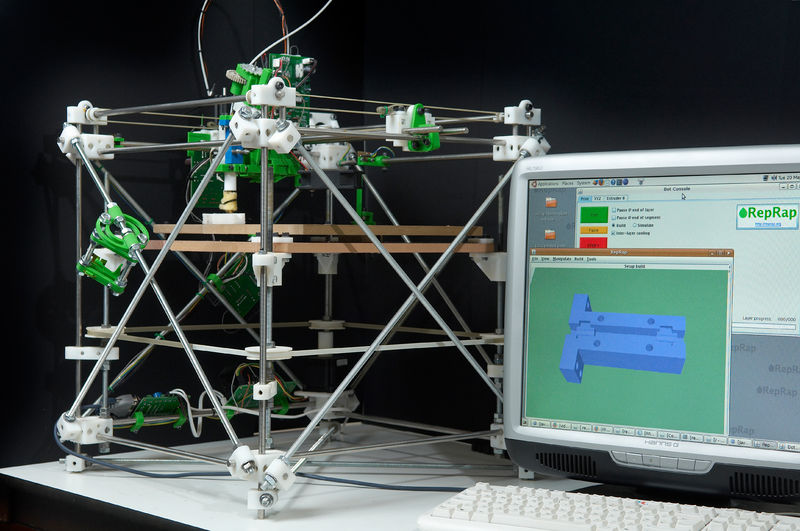
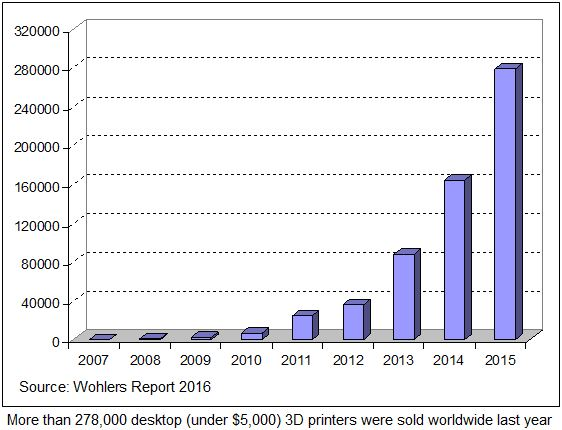

```{r setup, include=FALSE}
knitr::opts_chunk$set(echo = TRUE)
```

# Résumé

Depuis de début du XXI siècle, nous avons assisté à la démocratisation de l’impression 3D, en même temps que l’émergence du mouvement « Open Source Hardware ». La conjonction de ces deux phénomènes a ouvert des opportunités très significatives pour la conception dans l’industrie manufacturière traditionnelle, mais aussi pour des nouvelles activités telles que le recyclage des matières thermoplastiques. 
Dans ce chapitre nous proposons une méthodologie générale permettant le recyclage de polymères thermoplastiques dans le contexte open-source. La méthodologie développée a été utilisée dans le cadre du recyclage de l’acide polylactique (PLA).
Nous montrons le niveau de dégradation de la matière à travers l’ensemble du procédé grâce à la caractérisation des propriétés mécaniques et physico-chimiques, et concluons qu’il est possible de recycler le PLA pour l’impression 3D.  Enfin, nous étudierons les implications pour la diffusion de ce type de recyclage, et proposons en perspective d’étudier le recyclage en circuit court d’autres polymères thermoplastiques.   
	
**Mot clés :** Recyclage des Polymères, Fabrication Additive, Open-Source, Impression 3D,  Acide Polylactique (PLA), RepRap.	


# Introduction

En ce début de $XXI^{\grave{e}me}$ siècle, considérer qu'aujourd'hui encore, seul la technique transformerait la société toute entière, est clairement une hérésie.
Certes, les révolutions techniques sont là: explosion de l’internet, interconnexion et échanges entre personnes (peer to peer), apparition de nouvelles formes d’énergie, de nouveaux procédés de production, de nouveaux matériaux etc... mais l’homme n'est plus un simple consommateur Keynésien sensible uniquement au prix et aux incitations de l’état.
Il souhaite désormais, être acteur et participer à l’utilisation des nouvelles technologies mais de manière raisonnée et en intégrant les grands enjeux sociétaux tels que le partage et la sauvegarde des ressources et matières premières. 

<!-- %  Focus on Thesis -->
Dans le ce chapitre nous présentons comment une révolution technologique telle que la fabrication additive (FA) open source peut se développer tout en intégrant les défis sociétaux actuels et plus particulièrement les enjeux environnementaux. 
En effet cette dernière, aussi connue comme *impression 3D open-source (OS)* est l'une des technologies identifiées comme ayant un fort potentiel d'impact sur les systèmes de production, mais aussi plus largement, sur notre style de vie dans les années à venir. 
Sa principale particularité par rapport à la FA classique est le caractère *collaboratif de l'open source* qui permet des évolutions rapides et créatives, et ceci à moindre coût. 
Dans le cadre de ces travaux, nous préconiserons dans un premier temps ce qu'est la FA au sens large et nous proposerons un état de l'art des études menées sur le recyclage dans le contexte de la FA. 
Puis nous présenterons les spécificités liés au contexte open source et positionnerons les machines de FA utilisées dans ce contexte, en effet contrairement à la FA additive classique professionnel dont la robustesse des machines est assurée par les fabricants; nous devons dans un premier temps nous interroger sur les possibilités et limites des machines utilisées dans le contexte open source.  


# La Fabrication Additive (FA) commercial

<!-- %Definition of Additive Manufacturing -->
La fabrication additive  est le nom donné pour <<*l'ensemble des procédés permettant de fabriquer, couche par couche et par ajout de matière, d'un objet physique à partir d’un objet numérique*>>
[@Laverne2016, @ASTM2012].
Cette approche contraste avec les procédés traditionnels par enlèvement ou déformation de la matière tels que l'usinage, la fonderie ou la forge.
<!-- % Working Principles of AM -->
Ce principe est la base de toutes les machines de fabrication additive, avec quelques variations en fonction de la matière première utilisée,  la technique  pour la création de couches et le moyen physique pour  agglomérer les couches déposées.


<!-- %Synonims for AM -->
Diverses termes ont été  utilisés pour faire référence à ces méthodes de fabrication tels que *prototypage rapide, fabrication par couches, fabrication digitale, production rapide, impression *3D. 
<!-- % Root in topography and -->
Cependant, il faut remarquer que le principe physique sur lequel repose la FA a été utilisé dès la fin du XIXe siècle dans le cadre de la photo-sculpture et de la topographie \parencite{Zhai2014, Bourell2009}.
Il consiste à réaliser un produit grâce à un empilement successif de strates. 
La préparation de la maquette numérique permet de définir les sections de l’objet 3D à réaliser par son découpage successif par des plans parallèles. 
La distance entre chaque section correspond à l’épaisseur d’une couche. 
Pour reconstituer l’objet, les sections sont empilées de façon séquentielle  les unes sur les autres.


Une approche usuelle pour classer les différents types de technologies de la FA, est par la prise en compte de l'état initial de la matière première utilisée.
La figure \@ref(fig.AM.processes) présente la classification proposée dans ce contexte.

```{r AM.processes}

```


<!-- %Introduction to FDM -->
Dans le cadre de cette chapitre, nous nous sommes focalisées sur le procédé de Fused Deposition Modeling (FDM) (connu aussi comme FUsed Filament Fabrication -FFF-).
Il s'agit de l'une des technologies AM les plus répandues au niveaux mondial. 

Le principe de cette technologie réside dans déposition d'un fil de matière fondue habituellement d'un filament plastique, sur un substrat à l'aide d'une tête mobile.
Le matériau est chauffé à une température légèrement supérieure à son point de fusion dans la tête, puis extrudé par une buse sur un substrat et refroidi jusqu'à ce qu'il se solidifie et forme une couche.
Le polymères thermoplastiques sont de matériaux usuellement utilisés dans cette technologie.
Le brevet (US Patent 5121329 a été déposé  Juin 1992 \parencite{Crump1988, Crump1991}.


## Définition de la FA Open-Source:

<!-- % Intro -->
Depuis le milieu des années 2000, une nouvelle forme de FA est en train d'apparaître grâce à la démocratisation de cette technologie pour des communautés différentes de celles des entreprises et des communautés de la recherche.
% Notion de
La notion de FA open-source (aussi connue comme  *l'Impression 3D open-source (OS)*) est en train de se positionner comme une option viable de fabrication au vu de la conjonction de certains éléments tels que 
(1) l'expiration des premiers brevets protégeant la technologie commercial de la FA (notamment le Fused Deposition Modeling -FDM-), 
(2) l'évolution des technologies d'information et communication, et 
(3) les modes de développement et production basés sur le travail collaboratif (common-based peer production \parencite{Grodzinsky2006}). 


```{r Darwing.RepRap, fig.cap="Premier machine *RepRap* appelée 'Darwin' -Mai 2007-"}

```


## Projet RepRap:

<!-- % RepRap project and its influence. -->
L'une des première initiative pour démocratiser la FA a été faite par Adrian Bowyer et son équipe à travers du conception la projet appelé* *RepRap** (or **Rep**licating **Rap**id-prototyper) \parencite{HollandDO'DonnellG.Bennett2010a, Bailard2007, Jones2011}.
<!-- %Definition de RepRap -->
RepRap  est un projet britannique de l’Université de Bath, visant à créer une imprimante tridimensionnelle en grande partie auto-réplicative et libre (c’est-à-dire sans brevet, et dont  l'information technique est disponible gratuitement pour tous) sous licence  publique générale GNU.
Ce projet est basé sur le principe de dépôt de filament fondu (Fused Filament Fabrication)^[Fused Filament Fabrication (FFF) et Fused Deposition Modeling (FDM) sont des termes equivalentes, mais dû au fait que FDM est une marque déposée, le terme FFF á été employé].
<!-- %Le concept -->
Le concept de cette machine est fondé sur une relation mutualiste d’interdépendance entre la machine et l’utilisateur. 
La machine fabrique les pièces et l’utilisateur assemble ces pièces. 
C'est pour cela, que la machine RepRap peut être définie comme <<une machine cinématique assistée par ordinateur, auto-répliquante et fabricable soi-même>> \parencite{Jones2011} et en utilisant une démarche de conception l’open-design, où il est mise disposition de l'information technique. 
<!-- % Avantages -->
À partir de cette définition, il y a trois caractéristiques particulières:

- Le nombre de machines et la richesse qu’elles créent pourraient croître exponentiellement. 
- La machine devient un sujet d’évolution par sélection artificielle.  
- La machine crée de la richesse avec une dépendance minimal de la production industrielle.
	
La Figure \ref{3DP.Growth} confirme cette croissance exponentielle de ce type de machines.
Dans un travail récent, \textcite{Ford2014}, positionne cette type de technologies open-source comme les machine de fabrication additive les plus utilisées à l'heure actuelle.

```{r 3DP.Growth, fig.cap="Nombre de ventes de machines open-source. Source Wohlers Report 2016"}

```


<!-- % Importance of OS AM for some communities -->
Grâce à la démocratisation de ces projets, la fabrication de produits complexes et de grande valeur est devenue accessible à tous \parencite{Kostakis2013,Pearce2014k}.  
Le tableau \ref{OS.vs.Commercial.AM}  compare certaines caractéristiques  de la fabrication additive open-source et commerciale. 
Les principaux éléments qui expliquent la croissance exponentiel et l'intérêt de ce types de machines pour un grand public sont : le coût réduit par rapport aux machines commerciales, la disponibilité de l'information technique, et le support de tout une communauté connectée sur l'internet autour de cette technologie.
Ces éléments clés ont permis déclencher un processus de démocratisation de cette technologie.
De plus, cette technologie peut avoir un impact positif sur les communautés comme les laboratoires universitaires, les écoles, et ouvrir de nouvelles dimensions à l'enseignement des sciences qui peut avoir un impact marqué dans les pays en voie de développement \parencite{Irwin2014}.


\begin{footnotesize}
	\begin{table}
		\centering
		\caption[]{Comparaison des machines open-source et commerciales.}
		\begin{tabular}{r l l}		
			\toprule
			&\textcolor{blue}{FA Open-Source}& \textcolor{blue}{FA Commercial:}\\	
			\midrule
			
			\textbf{Principe:}	& CAD + GCode + Impression. & CAD + GCode + Impression.\\
			\textbf{Coût}	&   < \$5000&  $\$5.000$ jusqu'à  $\$800 K$ \\ 
			%	&&{\tiny \parencite{Hague2004}})\\
			\textbf{Méthodologie:}	& Open design  & Closed Design (Patented)\\
			\textbf{Développé par:}	& Communauté globale & Quelques entreprises \\
			\textbf{Imprimante:} & Personnalisé & Standardisé \\
			%	&&{\tiny(e.g. 3D systems, Stratasys, Arcam, Z-Corp...)}\\					
			%&{\tiny(Technical information available)}&\\
			\textbf{Exemple:}	& Projet \textbf{RepRap}  & Stratasys \\
			%		\textbf{Quality:}	&  & Quality is assured by company.\\	
			
			\bottomrule
		\end{tabular}	
	
	\label{OS.vs.Commercial.AM}
\end{table}		
\end{footnotesize}

# Le Recyclage dans la Fabrication Additive


<!-- %Intro to Recycling -->
Les possibilités et les caractéristiques de la FA ont été présentées.
Nous rappelons que le but principal de cette thèse est d'avoir une meilleure compréhension du processus de recyclage des polymères afin d'établir une option de gestion durable des déchets pour cette technologie de FA open-source.
<!-- % Introduction of the methodology used in this study -->
Pour cela, un état de l'art a été fait avec le but principal de connaitre les avances en recherche et le développement de l'utilisation de la matière recyclé dans les technologies de la FA.
<!-- % Making focus to Recycling in AM -->
Une méthodologie de revue systématique de la littérature a été adapté à notre cas particulier basse sur la recherche de \textcite{Kitchenham2007}.	
<!-- % Detailing the methodology -->
La figure \ref{SLR.methodology} présente les trois principales étapes: (1) Planification, (2) Conduite, et (3) Rapport.
Nous avons élaboré un protocole de recherche, en prenant en compte  les questions de recherche (QR) et les données à extraire.
<!-- %Conclusion of the methodology -->
<!-- The steps are described in detail in the following sub-sections. -->


```{r SLR.methodology, fig.cap="Méthodologie de revue systématique de la littérature. Adaptée de @Kitchenham2007."}
knitr::include_graphics("Figures/Francais/SLR-methodology.pdf")
```


<!-- % Introduction to the research questions -->
Le tableau \ref{Chap-1:Table.Research.questions} montre les deux questions de recherche utilisé pour la revue de la littérature:	

\begin{table}[!htb]
	\centering
	\begin{adjustbox}{max width=\textwidth}
		\begin{tabular}{l|p{8cm}|p{8cm}}
			\toprule 
			\textbf{ID} &\textbf{Question de Recherche} & \textbf{But}\\
			\midrule
			
			QR1 & 
			Quel est l'état de la recherche et le développement sur la recyclabilité de matière première dans le contexte de la fabrication additive? 	&
			Faire un état de lieux sur recherches actuelles pour la réutilisation des matériaux, la technologie et les protocoles afin d'évaluer la qualité de la matière recyclé. \\
			
			%RQ1 & What are the methodological elements to consider for materia recycling in AM?& To provide a background of the current research  about recyclability in AM identifying materials, technology and evaluation protocol of recycled material. \\
			
			QR2 & 
			%					What are the developments of open-source additive manufacturing in the polymer recycling context? 
			Quel sont les développement sur le recyclage de polymères afin d'être utilisées dans a FA open-source
			& 
			Identifier les avancées majeures sur  réutilisation polymères dans le contexte de la FA open-source.\\
			
			
			
			% Other Research questions 
			%  RQ2 & What are the areas of development of open source additive manufacturing?& To determine the main research fields for this technolgy \\
			%  RQ3 &What are the applications of the open source additive manufacturing? & To identify the main applications of this technology\\
			%  RQ1 & What are the drivers that have contributed to the development of open source additive manufacturing?& To identify the main reasons for the development of the open source additive manufacturing\\
			% What are the technologies develop so far of Open Source Additive Manufacturing  & & \\
			%	\item What are the materials are used in OS AM? & & \\
			%	\item 	\textit{Question 5:}Compare the evolution of the commercial technology vs. open source technology?
			
			\bottomrule
			
		\end{tabular} 
	\end{adjustbox}
	
	\caption[]{Question de recherche utilisées dans la revue de la littérature}
	\label{Chap-1:Table.Research.questions}
\end{table}


<!-- %  How much research activity has there been about recyclability in the Additive Manufacturing Context? -->
<!-- %Intro -->
En utilisant la classification des technologies de FA vu dans la figure \ref{Chap-1:Fig.AM.processes} (*Liquide, Particule Discrète, Feuille et Matériau Fondu*), 
le but principale de la RQ1 est l'identification des élements clés sur le recyclage (type de matière, protocole d'évaluation de la qualité, propriétés dans l'impression) de la littérature pour les différent technologies de la FA.		
Ces éléments permettent de comprendre la viabilité de l'utilisation de matériaux recyclés.

<!-- % What are the development of open source additive manufacturing in the polymer recycling context? -->
Dans le cas de QR2, nous  concentrons  la recherche sur le recyclage des polymères utilisés pour les machines open-source.
De la même façon, le but est d'identifier les développements au niveau expérimental/machine et de recherche méthodologique pour comprendre la faisabilité de ce processus.
%Il a été noté que l'une des principales caractéristiques de la FA open-source est la adoption exponentielle de cette technologie par différents types de communautés.


<!-- %Intro to Résults -->
En utilisant ces deux questions de recherche,  nous avons trouvé dans la littérature 47 articles concernant notre cadre d'étude.
	<!-- % Résultats -->
Un première résultat de notre revue est la mise en évidence que les études de recyclabilité dans le contexte des procédés de FA *Liquide* et *Sheet* restent encore une champ de recherche à explorer.
Par contre, plusieurs propositions ont été identifiés dans les procédés *Particule Discrète* et *Matériau Fondu*.

Dans le cadres des technologies FA commercial, des méthodologies de recyclage ont été identifiés afin d'évaluer l'évolution de la matière première que n'a pas été sintérise lors du processus d'impression.
\textcite{Raugel2015}  explicitent formellement une méthodologie utilisée pour évaluer le recyclage des poudres métalliques dans le procédé EBM.
Dans le cas de polymère, \textcite{Dotchev2009}  ont présenté une approche méthodologique pour évaluer les bonnes pratiques établies pour le recyclage des poudres dans le frittage de poudre (SLS), en utilisant du polyamide (nylon).


<!-- 	%  PRESENTING THE CURRENT RESEARCH FOCUS IN OUR RESEARCH -->
<!-- % Conection of OS 3DP and Recycling -->
Dans le cadre de la FA open-source, un des concept importants à souligner est celui du \textbf{recyclage distribué}.
<!-- %  OS extreudeuses -->
Ce concept consiste en l'utilisation de déchet plastique pour les transformer en matière première pour l'imprimante 3D 
grâce au développement des extrudeuses issues aussi de l'open-source.
Ce couplage des imprimantes 3D avec le dévelopment des extrudeuses  a été exploré comme une nouvelle approche prospective afin d'optimiser  la matière première pour ces machines.
Certains projets tels que  Precious plastic \parencite{Hakkens2016}, Plastic Bank \footnote{\hyperlink{http://plasticbank.org/}{http://plasticbank.org/}},  Precious plastic \footnote{\hyperlink{http://preciousplastic.com/ }{http://preciousplastic.com/ }} \parencite{Hakkens2016} sont basés sur ce concept.

<!-- % Consequences of this concept  -->
L'intérêt principal de cette approche est la réduction des coûts et des émissions de gaz à effet de serre liés à la collecte et au transport des déchets ainsi qu'à l'impact environnemental de la fabrication de pièces en plastique sur mesure.
Cette approche de \textbf{recyclage des polymères distribués} pourrait être une alternative supplémentaire au \textbf{recyclage centralisé classique }des polymères \parencite{Baechler2013, Kreiger2014, Anzalone2013, Kreiger2013,Feeley2014}.
<!-- % Importance of this approach distributed -->
Compte tenu de l'adoption croissante significative de la FA open-source, l'approche du recyclage distribué des polymères pourrait être très pertinente car les taux actuels de recyclage sont particulièrement faibles.

<!-- %Economical problematic of filament -->
D'un point de vue économique, les coûts de filaments commerciaux se situent entre $\$18.86$ et $\$175.20$ par kg,
qui est de 20 à 200 fois supérieur au coût du plastique brut.
<!-- % Literature approving this concept of Distributed polymer recycling -->
\textcite{Wittbrodt2013, Kreiger2014}  ont prouvé la faisabilité économique d'un modèle distribué avec le recyclage local des matières plastiques (filament recyclé) pour les imprimantes OS 3D dans lequel $ 1 kg $ de filament recyclé a été fabriqué à partir d'environ 20 bouteilles de lait pour moins de 10 cents US en utilisant le prototype d'extrudeuse open-source  appelée «Recyclebot».
<!-- % Energy justification -->
Concernant l'aspect énergétique,
\textcite{Kreiger2013,Baechler2013} ont prouvé le concept pour le recyclage des déchets de polymères de grande valeur, où les économies se situaient entre 69 \% et 82 \% d'énergie intrinsèque pour le recyclage distribué par rapport à l'approche centralisée de recyclage traditionnel.
<!-- % Validation of the Interest for recycling for OS 3DP -->
Par conséquent, il existe un intérêt dans le recyclage de matériaux polymères pour un contexte d'impression 3D en open source. 

Cependant, afin de comprendre le processus de recyclage des polymères pour établir une option de gestion durable des déchets pour cette technologie de FA open-source, il faut prendre en compte deux éléments fondamentaux:


- Vu la nature open-source des machines, il est nécessaire établir une caractérisation afin de comprendre la performance de ces machines par rapport à l'ensemble de procédés de fabrication.
	En outre, la relation entre les paramètres de fabrication / procédé / propriétés obtenus doit être clarifié.

- Une fois la performance des machines OS est caractérisé, nous nous intéressons pour le processus de dégradation des propriétés physico-chimiques du polymère à chaque cycle de recyclage, à la manière de traiter et de valider la pertinence et le nombre de fois qu'un matériau peut être recycle  


Ces deux éléments sont étudiés  par la suite.


# Vers une protocole standards pour la caractérisation des imprimantes OS

<!-- % Intro -->
La détermination des propriétés des objets faits à partir d’un processus de fabrication additive est un élément important en ingénierie. 
Il permet d’évaluer la capacité d’une machine, connaître ses avantages et ses inconvénients et pouvoir positionner cette machine dans le spectre des technologies disponibles aujourd'hui.
En connaissant les propriétés de la machine et les propriétés du matériau, nous pouvons alors fabriquer un objet qui répond à un besoin particulier.
La nature open-source des ce technologie fait qu'il est difficile de caractériser et positionner la performance de ces machines par rapport à l'ensemble de procédés de fabrication traditionnel.

Il existe deux méthodologies afin d’évaluer la performance d’une machine et/ou d’un processus ; 
(1) à travers une série de mesures directes sur la machine et des caractéristiques du processus, 
et (2) à travers des mesures d'objets d'essais manufacturés par la machine. 
Dans le contexte de la fabrication additive, la première méthodologie pour mesurer des caractéristiques tels que la vitesse, le positionnement, est difficile à réaliser.
En revanche, l’utilisation d’un modèle ou d’un objet de référence joue un rôle très important pour diagnostiquer et caractériser des machines et des processus dans la fabrication additive. 
C’est pour cela que le design d’un modèle d’analyse comparative permet d’évaluer les composants d’une machine,

```{r Methodology.Master, fig.cap="Méthodologie pour la caractérisation de performance dimensionnelle d'une imprimante open-source."}
knitr::include_graphics("Figures/Francais/Methodology-Master.pdf")
```

Dans le cadre de cette chapitre, nous proposons une méthodologie  pour évaluer la performance d'une imprimante OS avec deux but principaux. Le première est l'évaluation  de la performance géométrique en termes de la  précision dimensionnelle suivantes:


-  Plane **XY**
- Axe **Z**
- Opérations Circulaires -**D**-
- Opérations de parois fin -**T**-

	<!-- % Find the relationship of parameters - Quality of the printed part. -->
Le deuxième but est de trouver les paramètres de fabrication de la machine  qui donnent la plus haute précision dimensionnelle possible pour la fabrication d'un modèle.
La figure \ref{Methodology.Master} présente un aperçu des différentes étapes de la méthodologie proposée. 


```{r, echo=FALSE,out.width="49%", fig.cap="caption",fig.show='hold',fig.align='center'}
knitr::include_graphics(c("Figures/Francais/FoldaRap.jpg",
                          "Figures/Francais/GBM.pdf"))
``` 


\begin{figure}[!t]
	\centering	
		\begin{subfigure}[t]{0.4\textwidth}
		\centering	
		\includegraphics[height=3.5cm]{Figures/Francais/FoldaRap.jpg}	
		\caption[]{Imprimante open-source utilisée dans l'expérimentation}
		\label{Foldarap.Francais}
	\end{subfigure}
	\qquad
\qquad
	\begin{subfigure}[t]{0.4\textwidth}
		\centering	
		\includegraphics[height=3.5cm]{Figures/Francais/GBM.pdf}
		\caption[]{Modèle comparative utilisé (Geometric Benchmarking Model)}
		\label{GBM.Master.Francais}
	\end{subfigure}

	\caption[]{Modèle comparatif et imprimante 3D utilisée dans les cas expérimental}
	\label{Chapter1-Francais}	
\end{figure}

<!-- % Presentation of protocol -->
Nous avons testé cette méthodologie avec l'évaluation d'une imprimante représentative: la FoldaRap (figure \ref{Foldarap.Francais}).
Le modèle comparatif de référence utilisée est présentée dans la figure \ref{GBM.Master.Francais}.
Le plan d'expérience est couplé à l'approche  Taguchi.
18 échantillons ont été fabriques. 
Les résultats de cette méthodologie peuvent être résumés comme suivie:
	

1. Niveau de Précision: Probabilité 82.14\% pour avoir une mesure (-\%5,5)
1. International Standard Tolerance : \textbf{(IT14-IT16)}
1. Meilleur compromis des paramètres de fabrication: 
  - Épaisseur de couche (Layer thickness): 0.18mm
  - Largeur de la trame (Raster width) :0.71mm
  - Vitesse de mouvement (Nozzle speed movement): 50 mm/s


Sur la base de ces résultats, nous pouvons assurer que l'imprimante 3D est une machine suffisamment reproductible pour la fabrications des pièces.
Nous pouvons donc maintenant à continuation à caractériser le processus de recyclage des polymères pour cette technologie.

# Méthodologie pour recycler des polymères pour la fabrication additive

## Recyclage de polymères

<!-- %  PROVIDING  BACKGROUND PLASTICS -->
<!-- % About Plastic  -->
Le développement de matériaux polymères a permis la fabrication d'une large gamme de produits peu coûteux, de faible poids et de haute performance et il est devenu un élément essentiel du développement technologique et sociétal \parencite{Andrady2009}.
<!-- % Recycling problematic.  -->
Cependant, l'un des principaux problèmes est l'impact environnemental des résidus de plastique en raison de leur longévité qui peut atteindre plusieurs décennies \parencite{Hopewell2009}. 

<!-- 		%  PROVIDING  BACKGROUND ABOUT MECHANICAL RECYCLING -->
<!-- % Intro of Polymer Recycling -->
Dans l'écologie industrielle des polymères, différentes stratégies ont été étudiées pour la gestion des déchets plastiques, allant de la réutilisation et du recyclage (Mécanique, Chimique) jusqu'à des processus de thermolyse / récupération \parencite{Clift1997, Hopewell2009, Al-Salem2009}.

Dans le contexte de recyclage des thermoplastiques, une des stratégies développées pour le traitement de déchets est le recyclage mécanique. 
<!-- % Definition of mechanical recycling	 -->
Le recyclage mécanique est défini comme un processus qui permet de réutiliser directement des  déchets plastiques dans le procédé de fabrication des nouveaux produits. 
Dans ce cas, il n’y a pas de destruction significative de la structure chimique du polymère, tout au plus quelques modifications de ses propriétés physiques \parencite{Fisher2004, Hopewell2009, Al-Salem2009, Perugini2005, Robin2012}.
<!-- % Recyclage mécanique -->
En ce sens, le couplage de tests de caractérisation avec de multiples procédés d'extrusion ou de moulage par injection est une approche éprouvée pour évaluer la recyclabilité de matériaux polymères afin de simuler le cycle de vie prolongé des produits recyclés.
La figure \@ref{fig:mechanical.recycling.francais} présente un schéma générale de cette approche: 


```{r Mechanical.Recycling.Francais, fig.cap="Mechanical recycling steps for the case of fabrication of recycled filament."}
knitr::include_graphics("Figures/Francais/Multiple-Processing.pdf")
```


<!-- % Material -->
Dans ce modèle, une phase de départ est de considérer l'étude d'une *Matière Vierge*.
Une autre considération à remarquer est l'évaluation de la matière en circuit fermé, dont il n'y a pas d'ajout supplementaire de matière une fois le processus de recyclage commence.	
<!-- % Processus -->
La dégradation de la matière est directement liée au procédé utilisé et a la quantité de cycles étudiés dans le recyclage.
<!-- % Evaluation -->
Il est nécessaire de définir l'étape *Évaluation* afin d'avoir une quantification des propriétés du matériau recyclé.
<!-- % Fundamentl work for understanding quality of polymer recycling -->
Dans le cas de matière plastique recyclé, \textcite{Karlsson2004,Vilaplana2008} ont identifié trois axes majeurs pour l'évaluation de la qualité qui peuvent être résumées de la manière suivante:


\begin{minipage}[p]{0.48\textwidth}
	\begin{figure}[H]
		\flushleft
		\includegraphics[width=0.95\textwidth]{Figures/Francais/Quality-Recycling.pdf}
		\caption[]{Cadre d'évaluation de la matière plastique recyclé}
		\label{Fig:Quality.Recycling.Francais}
	\end{figure}	
\end{minipage}
\begin{minipage}[p]{0.48\textwidth}
	\begin{footnotesize}
		\begin{description}[noitemsep]
			\item[\textit{Degré de Mélange (DM):}]
			Cet axe mesure la présence de types de polymères et d'impuretés dans le matériau.
			
			\item [\textit{Composés de bas poids moléculaire (LMWC):}]
			Cet axe fait référence à la présence de contaminants, additifs et d'autres éléments dans la matrice.
			Il est importante afin de répondre aux exigences législatives.
			
			\item [\textit{Degré de dégradation (DD):}] 
			
			Cet axe détermine l'évolution de la dégradation du polymère à l'échelle macro/microscopique due au procédés de fabrication et à la durée de vie.
		\end{description}
	\end{footnotesize}
\end{minipage}


Le travaux de \textcite{Badia2016} présentent une caractérisation multi-niveaux complète dans lequel sont représentées les différentes axes d'analyse (\textit{DM, LMWC, DD}), ainsi que les techniques analytiques couramment utilisées pour tester l'état de performance et / ou de dégradation du matériau résultant.
% Conclusion
Enfin, en fonction de la (ou les) propriété(s) qui seront analysées lors du processus de recyclage mécanique,
de protocoles expérimentaux adéquats peuvent être mis en œuvre.
Finalement, une étape de recyclage est caractérisé a fin de pouvoir réutiliser la matière.


## Méthodologie pour évaluer le potentiel de recyclabilité

Basée sur les caractéristiques du processus de recyclage mécanique, nous proposons d'adapter un méthodologie systématique pour évaluer la dégradation des polymères thermoplastiques dans la chaîne des procédés de l'impression 3D.
Cette méthodologie permet de comparer la dégradation de la matière en utilisant un procédé *standard* de fabrication (e.g. injection) par rapport à l'impression.
En plus, un deuxième but est de quantifier l'impact du procédé d'impression lui-même sur la dégradation de la matière.
La figure \@ref{fig:Recycling-Methodology-Fr} montre la méthodologie proposée.

```{r Recycling.Methodology.Francais, fig.cap="Méthodologie pour évaluer la faisabilité de recyclage dans la FA open-source"}
knitr::include_graphics("Figures/Francais/Recycling-Methodology.pdf")
```


### Etape 1 ``Définition du matériau''
	
	<!-- %  MATERIAL DEFINITION -->
	<!-- %Goal of  the  "Material Definition" -->
Le but principale de cette étape, appelé *``Définition du matériau''*  (figure \ref{Recycling.Methodology.Francais}),   est la caractérisation du la matière première à étudier.
	<!-- % Recall the polymer characteristics -->
	Les caractéristiques donnés par le fournisseur du polymère doivent être prises en compte pour l'établissement initial des conditions opératoires. 
	
	<!-- % Consideration of the POlymer Quantity -->
	De même, la quantité de matière nécessaire total pour l'étude globale doit être estimée.
	Cependant, dans le but d'avoir une estimation réelle de la quantité de matière, il est nécessaire de prendre en compte des éléments qui seront définis dans les étapes subséquentes.
	<!-- % Element to define -->
	Ces éléments sont:
	
		
	- Idéntification des propriétés du matériau à étudier lors du processus de recyclage (étape détaillée dans le \hyperlink{Step2}{step 2})
	- Définition des chaînes de processus de recyclage nécessaires pour la cáractérisation de la matière dégradé  (étape détaillée dans le \hyperlink{Step3}{step 3})
	- Définition du nombre de cycles à tester.
	- Estimation de la perte de matière éventuelle pendant les cycles de recyclage, afin de prévoir dès le début de l'expérimentation les quantités adéquates de matière. 
		
		
	
	
	\item[ \hypertarget{Step2}{Etape 2 ``Procédés''}]: 
	
	%  PROCESS ASSIGNMENT
	
	Cette étape est divisée en deux parties:
	
	\begin{itemize}[noitemsep]
		% Reference process. Selection of the property that it will be study
		\item 	\textbf{\textit{``Chaînes de processus de recyclage'}}: Il s'agit de l'identification des chaînes de processus de recyclage qui seront utilisées pour la caractérisation des propriétés du polymère recyclé.
		
			% Explication of the "Recycling process chains"
		 Afin de mettre en évidence les effets des différents procédés sur le matériau, au moins quatre chaînes de recyclage sont nécessaires pour comparer la dégradation du matériau:
		
		
		\begin{itemize}[noitemsep]
			% Cycle Reference
			\item \textit{Référence:} Il est utilisé comme une référence de la dégradation pour le matériau recyclé.
			
			%Cycle of 3DP
			\item \textit{3D Printing:} Il est utilisé pour évaluer la dégradation du matériau à la suite du processus d'impression 3D avec des échantillons réalisés à l'aide d'une imprimante 3D avec des paramètres établis.
			
			
			%Cycle of feedstock
			\item	\textit{Feedstock:}  Il est utilisé pour évaluer l'impact de la dégradation dû à la fabrication de la matière première pour les machines d'impression 3D considérées (c'est-à-dire les filament, les granules, la poudre, etc ...).
			
			
			%Cycle of 3DP (reference)
			\item  \textit{3DP (Référence):} Il est utilisé pour évaluer la dégradation du matériau dû au processus d'impression 3D en utilisant l'équipement standard.
			
			
			
		\end{itemize} 
		
		En outre, plusieurs éléments caractéristiques mécaniques, thermiques, rheologiques et morphologiques peuvent illustrer la dégradation du polymère \parencite{Vilaplana2007, Vilaplana2008}.
		Pendant cette étape, l'expérimentateur doit déterminer son choix, en sélectionnant les propriétés qui seront étudiées par le processus de recyclage.
		
		
		% Fabrication of the 3DP feedstock
		\item	 \textbf{\textit{``Préparation de la matière première pour l'impression 3D''}}: 
		Le but de cette étape est d'identifier le(s) procédé(s) requis pour la fabrication de la matière première pour l'imprimante.
		Donc, la caractérisation de ces procédés et l'établissement des conditions opératoires est indispensable afin de définir les différent propriétés.
		En plus, une définition de la qualité de la matière obtenue est essentiel afin de garantir la qualité pendant le processus d'impression.
		
	\end{itemize}
	
	\item[ \hypertarget{Step3}{Etape 3 ``Fabrication des échantillons''}]: 
	
	Il y a deux buts principaux dans cette étape:
	
	\begin{enumerate}
		% Explaining the manufacturing processes of the samples
		\item D'abord, deux types de procédés sont proposés afin de comparer la dégradation de la matière:
		les procédés \textit{Standard} et \textit{l'Impression 3D}: 
		
		\begin{itemize}[noitemsep]
			
			% Explication of the goal of Standard and 3DP processes
			% Goal of the "Standard process"
			\item 	 \textit{``Standard''}: Ce procédé servira de référence pour comparer les résultats obtenus de dégradation avec le procédé d'impression 3D.	
			%Definition de conditions opératoires
			Il est nécessaire de caractériser l'équipement et définir les conditions opératoires à utiliser pour la fabrication des échantillons qui seront le référence de dégradation. 
			%enabling the quality assessment of the recycled material must be defined.
			C'est la raison pour laquelle, il est impératif d'identifier les normes internationales par rapport aux propriétés choisies dans le étape précédente (\hyperlink{Step2}{Step 2- Processus de référence}).
			
			
			% Goal of "3DP process"
			\item 	\textit{``Impression 3D''}: Dans un premier moment, le but est de caractériser l'imprimante open-source utilisé dans l'expérimentation. 
			Dans un deuxième moment, la définition des paramètres de fabrication pour les échantillons. 
			%Literature reviwe about the parameters
			Une revue de la littérature sur la propriété sélectionnée dans le contexte de fabrication additive commerciale  peut donner un aperçu initial des paramètres importants à considérer.
			
		\end{itemize}
		
	
		
		
	\end{enumerate}
	
	
	
	\item[ \hypertarget{Step4}{Etape 4 ``Évaluation''}]: 
	
	% Goal of the step: Evaluation 
	Le principaux objectifs de cette étape sont la définition des paramètres qui décrivent les propriétés ciblées et la définition de l'équipement sélectionné pour l'évaluation.
	% Description of the test
	Les tests sont effectués afin de recueillir les données selon les procédures internationales, et en considérant également l'ensemble des échantillons selon les chaînes de recyclage proposés.
	
	
	\item[ \hypertarget{Step5}{Etape 5 ``Recyclage''}]:
	
	%Intro
	Finalement, le but de cette étape est d'acconditionner la matière récyclée pour le retraitement.
	% Description of Recycling
	Le processus de recyclage est réalisé individuellement pour chaque chaîne de recyclage.
	% Steps to consider for recycling 
	Une caractérisation de l'équipement de recyclage utilisé et une description des caractéristiques du matériau recyclé obtenu sont réalisées.
	
\end{description}


\subsection*{Recyclage de l'Acide Polylactique (PLA) pour l'Impression 3D}

Nous applicons la méthodologie présenté dans la figure \ref{Recycling.Methodology.Francais} à un cas particulier.
%  PLA
Le matériau sélectionné est l'acide polylactique (PLA)  type 4043D (NatureWorks).  
Ce matériau est destiné à la fabrication de matière première pour les imprimantes 3D selon les spécifications du fabricant.

% Introduction of PLA
L'acide polylactique (PLA) est l'un des plus importants polymères bio-sourcés, biodégradables et biocompatibles \parencite{Drumright2000,Mohanty2000,Henton2005,Luckachan2011, Soroudi2013}. 
% Definition of the PLA
Le PLA est un polyester aliphatique  thermoplastique obtenue à partir des ressources renouvelables (e.g. pomme de terre, l'amidon du maïs, la canne à sucre et le sucre de maïs)  en usant un procédé de polymérisation par ouverture de cycle du lactide \parencite{Agrawal2003,Hamad2013, Castro-Aguirre2016}.
% Aplications of the PLA
Le PLA offre des potentiels avantages nombreuses pour une large gamme d'applications de produits tels que des bouteilles, des plateaux, des conteneurs, entre autres.
% Showing results
Le tableau \ref{Application.Methodology.Francais} montre un résumé des éléments les plus importants qui ont été considérés lors de l'application de la méthodologie.


\begin{center}
	\begin{longtabu} to \textwidth {X[0.2, r]  X[0.8, l] | X[1.2, l] X[1, l] }
		%\centering
		
		\caption[]{Application de la méthodologie au cas du recyclage du PLA pour l'impression 3D}	\\
		
		\toprule	
		
		& \textbf{Étape} & \textbf{Éléments à Définir} & \textbf{Notre cas expérimental}   \\	
		\midrule[1pt]		
		\endfirsthead
		
		
		\multicolumn{3}{c}{{\bfseries \tablename\ \thetable{} -- continuation de la page précédente}} \\[0.5mm]			
		\toprule			
		& \textbf{Étape} & \textbf{Éléments à Définir} & \textbf{Notre cas expérimental}   \\	
		\midrule[1pt]
		\endhead
		
		
		\midrule 
		\endfoot
		
		\bottomrule						
		\endlastfoot
		
		
		
		
		\textbf{1.} & Définition du matériau&  & Acide Polylactique (PLA)\\
		
		\midrule 
		
		\multirow{2}{*}{\textbf{2.1}} & \multirow{2}{*}{Procédés de Référence} & Chaines de recyclage & Quatre chaînes de recyclage \\
		&   & Propriété à évaluer & Propriétes mécaniques \\ 
		
		\midrule 
		
		\multirow{2}{*}{\textbf{2.2}}& Matière première & Procédé de fabrication  & Extrusion \\ 
		&pour  l'Impression 3D&Paramètre de Qualité & Diamètre du Filament \\
		
			\midrule
		\multirow{2}{*}{\textbf{3.1}} &Fabrication & Normes  &  ISO 527-1B \\
		 &\textit{Standard}&  Internationaux &   (Propriétés Mécaniques)\\
		\midrule 
		
		\multirow{2}{*}{\textbf{3.2}}&Fabrication & Caractérisation des Imprimantes& \textit{FoldaRap, Mondrian}\\
		&\textit{Impression 3D} &Paramètres & Deux type d'éprouvettes ($0/90 - 45/45 $) \\
		
			\midrule
		\textbf{4.}& Evaluation & Parametrès & Elastic Modulus, tensile strength and tensiles strain values\\
		
			\midrule
			
		\multirow{2}{*}{\textbf{5.}}&\multirow{2}{*}{Recyclage}  & Procédé & Broyage\\
			&& Granulométrie & 0.2-2 $mm$\\
		
		\bottomrule
		
		\label{Application.Methodology.Francais}
	\end{longtabu}
\end{center}
	

Une adaptation du processus de recyclage mécanique a été fait afin de définir  les chaînes de recyclages.
La figure \ref{Fig:Recycling.Process.Chains.Francais} présente les quatre chaînes de recyclage qui  ont pour but final de qualifier la  dégradation des propriétés mécaniques dû au effet des divers procédés.


\begin{figure}[H]
	\centering
	\includegraphics[scale=0.4]{Figures/Francais/Recycling-Process-Chains.pdf}
	\caption[]{Chaînes de recyclage pour évaluer la dégradation du matériau.}
	\label{Fig:Recycling.Process.Chains.Francais}
\end{figure}	


A partir des quatre chaînes de recyclage, il est possible de comparer la dégradation du matériau en utilisant un procédé traditionnel tels que l'injection et le procédé d'impression 3D.
La figure \ref{Comparation.mechanical.properties.Frances} présente le résultat de notre démarche expérimentale.
%


\begin{figure}[!ht]
	\centering
	\begin{subfigure}[t]{0.49\textwidth}
		\centering
		\includegraphics[scale=0.45]{Figures/Francais/Ref-3DP-Tensile-Strength.pdf}		
		\caption[]{Valeurs moyennes de résistance à la traction  pour les chaînes  \textit{Réference} et \textit{3D Printing}}
		\label{Comparation.tensile.Reference.vs.3DP.Frances}
	\end{subfigure}%
	\hfill
	\begin{subfigure}[t]{0.47\textwidth}
		\centering
		\includegraphics[width=\textwidth]{Figures/Francais/Ref-3DP-Elastic-Modulus.pdf}	
		\caption[]{Valeurs moyennes du module d'élasticite pour les châines \textit{Réference} et \textit{3D printing}}
		\label{Comparation.Modulus.Reference.vs.3DP.Frances}
	\end{subfigure}
	
	\vspace{0.5cm}		
	
	\begin{subfigure}[t]{0.49\textwidth}
		\centering
		\includegraphics[scale=0.45]{Figures/Francais/Fed-3DP-Tensile-Strength.pdf}		
		\caption[]{Valeurs moyennes de résistance à la traction  pour les chaînes  \textit{Feedstock} et \textit{3D printing (Réference)}}
		\label{Comparation.tensile.Feedstock.vs.3DP.compounding.Frances}
	\end{subfigure}%
	\hfill
	\begin{subfigure}[t]{0.47\textwidth}
		\centering
		\includegraphics[width=\textwidth]{Figures/Francais/Fed-3DP-Elastic-Modulus.pdf}	
		\caption[]{Valeurs moyennes du module d'élasticite pour les châines \textit{Feedstock} et \textit{3D Printing (Réference)}}
		\label{Comparation.Module.Feedstock.vs.3DP.compounding.Frances}
	\end{subfigure}
	
	
	\caption[]{Évolution des propriétés mécaniques des chaînes de recyclage}
	\label{Comparation.mechanical.properties.Frances}
\end{figure}

% Reference VS 3DP Tensile Strength
Nous avons sélectionné 8 échantillons pour chaque chaîne de recyclage afin d'avoir suffisamment de reproductibilité dans nos résultats.
Dans le cas de la chaîne \textit{3D Printing}, 16 échantillons ont été sélectionnes 8 pour le remplissage $0/90$ et 8 pour le cas de  $45/45$.
Une première observation de la comparaison est que dans tous le cas, les échantillons injectés présentent des meilleure propriétés que ceux imprimés tel qu'il est présenté dans la figure \ref{Comparation.tensile.Reference.vs.3DP.Frances}. 
La différence entre ces deux procédés de fabrication est d'environ 10 \textit{MPa} dans le première cycle, qui est en accord avec la littérature  \parencite{Tymrak2014a, Wittbrodt2015}.
Cependant, 	cette différence augmente jusqu'à  environ 20 \textit{MPa} dans le cinquième cycle.

% Reference VS 3DP Module Elasticite 
Les résultats représentés dans la figure \ref{Comparation.Modulus.Reference.vs.3DP.Frances} montrent que le module élastique peut être considéré comme indépendant du processus de recyclage et de fabrication.
Il pourrait être considéré comme constant pour les échantillons injectés (chaîne \textit{Reference}) dans une intervalle de variation entre $3300-3500$ \textit{MPa}.
Pour le cas des échantillons imprimés ($45/45$ et $0/90$ ), une faible augmentation du module élastique est observée du premier au dernier cycle avec de valeurs moyennes de $3277.7$ à $3432.6$ \textit{MPa} respectivement.

	% Hipothesys of change of mechanical properties of 3DP due to change in fluidity of material
Une possible explication à cette augmentation du module d'élasticité pour les échantillons imprimés, est  qu'elle est associée au changement de viscosité du matériau, conséquence du procédé de recyclage.
Les caractéristiques de la méso-structure et de la liaison fibre-fibre des échantillons d'impression changeront aussi à mesure que le nombre de cycles de recyclage augmente.
% Literature of FDM sur viscosity and mechanical properties
Selon la littérature, certains défauts internes qui affectent la qualité structurale des pièces imprimées sont  les vides, les pores et les vides sous-périmétriques dus à la forme arrondie et oblongue du matériau déposé \parencite{Agarwala1996, N.Turner2014}.
Dans le procédé d'impression, le matériau imprimé se propage dans une forme oblongue dont la vitesse d'étalement et la forme finale dépendent de la viscosité de la matière fondue et des énergies de surface relatives de la trame déposé  et de la surface sur laquelle elle est imprimée \parencite{N.Turner2014}. 
% Conclusion of aumentation of Elastic modulus
Finalement, les propriétés mécaniques globales de la pièce dépendront de la zone de contact entre les trames (et les couches) déposées, de la taille des vides et des propriétés du matériau elles-mêmes.

% Hypothesis
Par conséquent, une hypothèse pour expliquer le comportement similaire entre les chaînes de processus \textit{Reference} et \textit{3D Printing} en termes de module élastique à la fin du cinquième cycle est qu'il y a une réduction appréciable des défauts internes,  provoquée par la diminution de la viscosité du matériau, ce qui facilite l'homogénéisation des couches déposées.
%
Nous pouvons alors présumer, que la méso-structure interne des échantillons imprimés pourrait être similaire à celle de l'injection.
Néanmoins, cette réduction de la viscosité est une conséquence de la dégradation du matériau, entrainant l'un changement de de propriétés de traction.


% Feedstock VS 3DP (Reference)Tensile Strength
D'autre part,  les figures \ref{Comparation.tensile.Feedstock.vs.3DP.compounding.Frances} et \ref{Comparation.Module.Feedstock.vs.3DP.compounding.Frances} montrent les résultats des propriétés mécaniques des chaînes de recyclage \textit{Feedstock} et \textit{3D Printing (Réference)}. 
L'unique différence entre ces deux chaînes est un processus d'impression 3D dans la dégradation du matériau.
Concernant le module d'élasticité, nous pouvons voir que cette propriété reste virtuellement constante pendant le cycles.
Nous pouvons constater qu'il existe un effet de l'impression 3D sur le matériau. 
Il est négligeable quand la matière est vierge, par contre,
cette influence augmente au fur et à mesure que le matériau est de plus en plus dégradé.
Il est important d'analyser ces résultats d'un point de vue chimique afin de caractériser la dégradation au niveau microscopique.
 

Tableau \ref{Results.Methodology.Francais} Les résultats spécifiques peuvent être résumés comme suit:

	\bigskip
\begin{footnotesize}
	
	\begin{center}
		
		\begin{longtabu} to \textwidth {X[1.4, c] | X[1, c] X[1, c] X[1.3, c] X[1, c] X[1.3, c]}
		
		\caption[]{Variation des propriétés mécaniques du PLA après cinq cycles de recyclage}\\
		
			
			\toprule	
			& \multicolumn{5}{c}{\textbf{{\normalsize Réduction des propriétés mécaniques}}}   \\
			Chaîne de Recyclage & Module d'élasticité & Résistance à la tension & Résistance a la rupture & Déformation à la tension & Déformation à la rupture  \\
			
			\midrule 		
			\endfirsthead
			
			\multicolumn{6}{c}{{\bfseries \tablename\ \thetable{} -- continuation de la page précédente}} \\[0.5mm]			
			\toprule	
			& \multicolumn{5}{c}{\textbf{{\normalsize Réduction des propriétés mécaniques}}}   \\
			Chaîne de Recyclage & Module d'élasticité & Résistance à la tension & Résistance a la rupture & Déformation à la tension & Déformation à la rupture  \\
			
			\midrule 		
			\endhead
			
			\midrule 
			\endfoot
			
			\bottomrule						
			\endlastfoot


			\textbf{Référence}	& $-3.7\%$ & $-19.81\%$ & $-15.95\%$ & $-27.31\%$ & $-40.65\%$ \\ 

			\midrule 

			\textbf{3D Printing ($0/90$)}	& $+4.1\%$ & $-38.15\%$  & $-39.29\%$ &$-52.20\%$ & $-57.43\%$ \\ 
			\textbf{3D Printing ($45/45$)}	& $+4.7\%$  & $-41.27\%$ & $-40.08\%$ & $-53.08\%$ & $-56.53\%$ \\ 
		
			\midrule 

			\textbf{Feedstock}	& \textit{Constant} & $-47.56\%$  & $-42.52\%$ &$-58.57\%$ & $-70.84\%$ \\ 

			\midrule 
			
			\textbf{3D Printing (Reference)}	& \textit{Constant}  & $-71.34\%$ & $-72.58\%$ & $-78.93\%$ & $-86.49\%$ \\ 

			
		\label{Results.Methodology.Francais}		
	\end{longtabu}
	\end{center}
\end{footnotesize}

\bigskip


Une conclusion importante des résultats de cette thèse est la faisabilité technique pour l'utilisation de matière recyclé pour la technologie de la fabrication additive open-source, plus ponctuellement pour les machines qui sont basées sur le procédé de dépôt de filament (\textit{Fused Filament Fabrication (FFF)}).
%
En outre, Un protocole expérimental a été établi avec deux objectifs principaux: (1) évaluer la qualité de l'imprimante 3D en termes de précision dimensionnelle.
Et (2), pour identifier le lien entre les paramètres du processus et la qualité du processus d'impression.
Nous avons démontré que ces type de machine ope-source peuvent être comparables avec les systemes commerciaux en termes de précision dimensionnelle
%
D'autre part, sur la base d'une première littérature sur la fabrication additive (FA), une large pistes de recherche a été identifiée et pourraient être explorée afin de souligner les avantages potentiels de l'AM sur les questions de durabilité.
Une des pistes pour continuer le développement de cet travaux sont liées à la caractérisation du point de vue chimique et microscopique sur la dégradation de la matière. 
Cela devrait permettre de mieux comprendre les phénomènes physiques de dégradation présent dans le processus de l'impression 3D.
D'autre part, des éléments logistiques, économiques et de modélisation de la filière pour recycler sont des pistes importantes pour formaliser cet approche distribuée de recyclage.
Et notamment, ces éléments peuvent être intégrées dans un concept de \textit{Green Fablab}, dont ces matières recyclés peuvent être réutilisées dans ces espaces de co-création.


