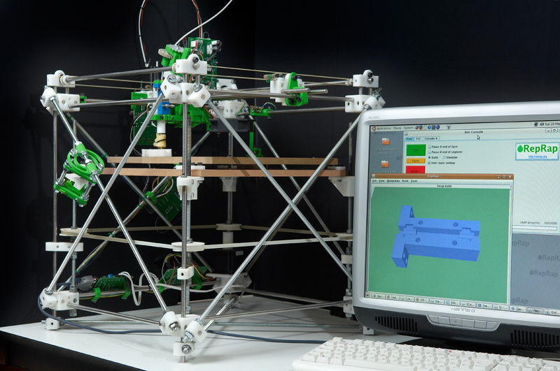
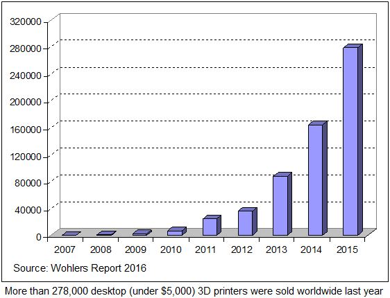

```{r setup, include=FALSE}
knitr::opts_chunk$set(
  fig.width=9, fig.height=3.5, fig.retina=3, fig.align = 'center', 
  out.width = "100%",
  cache = FALSE,
  echo = FALSE,
  message = FALSE, 
  warning = FALSE,
  fig.show = TRUE,
  hiline = TRUE,
  include = TRUE
)

library(tidyverse)
library(flextable)
set_flextable_defaults(fonts_ignore=TRUE)
# Link for the Figures
URL = c('https://raw.githubusercontent.com/fabbiocrux/Figures/main/')


```

# Résumé {.unnumbered }

Depuis de début du $XXI^{ème}$ siècle, nous assistons à la démocratisation de la fabrication additive , en même temps que l’émergence du mouvement « Open Source Hardware», à savoir le développement de la technologie de manière ouverte par tout à chacun. La conjonction de ces deux phénomènes a fait émerger de nombreuses  opportunités  pour la conception et la fabrication dans l’industrie manufacturière, mais aussi pour le développement d’activités connexes telles que le recyclage des matières thermoplastiques. Dans ce chapitre nous proposons une méthodologie générale permettant le recyclage de polymères thermoplastiques dans un  contexte de fabrication additive. La méthodologie développée a été utilisée en considérant  la matière plastique à ce jour la plus utilisée dans l’impression 3D open source à savoir l’acide polylactique (PLA). Nous évaluons  le niveau de dégradation de la matière à travers l’ensemble du procédé grâce à la caractérisation des propriétés mécaniques et physico-chimiques, et concluons qu’il est possible de recycler le PLA plusieurs fois pour le réutiliser en impression 3D. Enfin, nous étudierons les implications pour la diffusion de ce type de recyclage, et proposons en perspective d’étudier le recyclage en circuit court d’autres polymères thermoplastiques.   
	
**Mot clés :** Recyclage des Polymères, Fabrication Additive, Open-Source, Impression 3D,  Acide Polylactique (PLA), RepRap.	


# Introduction

En ce début de $XXI^{\grave{e}me}$ siècle, considérer qu’aujourd’hui encore, la technique seule transformerait la société tout entière, est clairement une leurre. Certes, les révolutions techniques sont là : explosion de l’internet, interconnexion et échanges entre personnes (peer to peer), apparition de nouvelles formes d’énergie, de nouveaux procédés de production, de nouveaux matériaux etc..., mais l’homme n’est plus un simple consommateur Keynésien sensible uniquement au prix et aux incitations de l’état. Il souhaite désormais, être acteur et participer à l’utilisation des nouvelles technologies mais de manière raisonnée et en intégrant les grands enjeux sociétaux tels que le partage et la sauvegarde des ressources et matières premières.

Dans le cadre de nos travaux nous présentons comment une révolution technologique telle que la fabrication additive (FA) open source peut se développer tout en intégrant les défis sociétaux actuels et plus particulièrement les enjeux environnementaux. En effet cette dernière, aussi connue comme *impression 3D open-source (OS)* est l’une des technologies identifiées comme ayant un fort potentiel d’impact sur les systèmes de production, mais aussi plus largement, sur notre style de vie dans les années à venir. Sa principale particularité par rapport à la FA classique est le caractère collaboratif de l’open source qui permet des évolutions rapides et créatives, et ceci à moindre coût. Dans le cadre de ces travaux, nous préconiserons dans un premier temps ce qu’est la FA au sens large et nous proposerons un état de l’art des études menées sur le recyclage dans le contexte de la FA. 
<!-- Puis nous présenterons les spécificités liés au contexte open source et positionnerons les machines de FA utilisées dans ce contexte, en effet contrairement à la FA additive classique professionnel dont la robustesse des machines est assurée par les fabricants; nous devons dans un premier temps nous interroger sur les possibilités et limites des machines utilisées dans le contexte open source.  -->

Enfin, nous nous intéresserons au potentiel de recyclage de polymères dédiés à la FA open-source et nous proposerons une méthodologie permettant la caractérisation de la dégradation physique de la matière recyclée tout au long de la chaîne de recyclage et d’impression. 
Les résultats de l’application de la méthodologie proposée au cas particulier de l’acide polylactide (PLA), une matière largement utilisée dans l’impression 3D, seront présentées comme preuve du concept. 
Pour finir nous conclurons et rappellerons l’ensemble des avancées obtenu au cours de ces travaux et comme perspectives nous proposerons des voies de recherches permettant de mieux développer les innovations sur les systèmes de recyclage de déchets actuels grâce à la fabrication additive open-source et ainsi, contribuer tout du moins partiellement, à résoudre la problématique globale que représente l’accumulation de matière plastique dans la nature.

# Cadre théorique

## La Fabrication Additive (FA) commercial {#la-fabrication-additive-fa-commercial }

La fabrication additive est le nom donné pour *l’ensemble des procédés permettant de fabriquer, couche par couche et par ajout de matière, d’un objet physique à partir d’un objet numérique*>> [@Laverne2016; @ASTM2012].
Cette approche contraste avec les procédés traditionnels par enlèvement ou déformation de la matière tels que l’usinage, la fonderie ou la forge. 
Ce principe est la base de toutes les machines de fabrication additive, avec quelques variations en fonction de la matière première utilisée, la technique pour la création de couches et le moyen physique pour agglomérer les couches déposées.

Divers termes ont été utilisés pour faire référence à ces méthodes de fabrication tels que  *prototypage rapide, fabrication par couches, fabrication digitale, production rapide, impression 3D*. 
Cependant, il faut remarquer que le principe physique sur lequel repose la FA a été utilisé dès la fin du XIXe siècle dans le cadre de la photo-sculpture et de la topographie [@Zhai2014; @Bourell2009]. 
Il consiste à réaliser un produit grâce à un empilement successif de strates. La préparation de la maquette numérique permet de définir les sections de l’objet 3D à réaliser par son découpage successif par des plans parallèles. 
La distance entre chaque section correspond à l’épaisseur d’une couche. Pour reconstituer l’objet, les sections sont empilées de façon séquentielle les unes sur les autres.

Une approche usuelle pour classer les différents types de technologies de la FA, est à travers  la prise en compte de l’état initial de la matière première utilisée. Dans ce travail nous ne considérerons pas les procédés impliquant les matières métalliques et nous ferons  un focus sur  sur les procédés quiutilisent les polymères tel que visible dans la classification proposée à la la figure \@ref(fig:am-processes).


```{r am-processes, fig.cap="Classification des technologies de la FA. Adaptation de [ @CruzSanchez2020]"}
knitr::include_graphics(paste0(URL, "AM/AM-Processes-00.png"))
#knitr::include_graphics("Figures/Francais/AM-processes.pdf")
```


Dans le cadre du présent chapitre, nous nous sommes focalisés sur le procédé Fused Filament Fabrication (FFF) plus connu sous l’appellation déposé par Stratasys dite de Fused Deposition Modeling (FDM). Il s’agit de l’une des technologies AM les plus répandues au niveau mondial.

Le principe de cette technologie réside dans déposition d’un fil de matière fondue habituellement d’un filament plastique, sur un substrat à l’aide d’une tête mobile. Le matériau est chauffé à une température légèrement supérieure à son point de fusion dans la tête, puis extrudé par une buse sur un substrat et refroidi jusqu’à ce qu’il se solidifie et forme une couche. Les polymères thermoplastiques sont de matériaux usuellement utilisés par cette technologie. Le brevet d’invention de la déposition du fil fondu, a été déposé Juin 1992 (US Patent 5121329) [@Crump1988; @Crump1991].

## Définition de la FA Open-Source : {#définition-de-la-fa-open-source }

Depuis le milieu des années 2000, une nouvelle forme de FA a émergé grâce à la démocratisation de cette technologie pour des communautés différentes de celles des entreprises et des communautés de la recherche. La notion de FA open-source (aussi connue sous le terme *d'Impression 3D open-source (OS)*) est en train de se positionner comme une option viable de fabrication au vu de la conjonction de certains éléments tels que (1) l'expiration des premiers brevets protégeant la technologie commercial de la FA (notamment le Fused Deposition Modeling -FDM-), (2) l'évolution des technologies d'information et communication, et (3) les modes de développement et production basés sur le travail collaboratif (common-based peer production [@Grodzinsky2006]).

```{r darwing-reprap, fig.cap="Premier machine *RepRap* appelée 'Darwin' -Mai 2007-", out.width='400px', fig.align='center'}
knitr::include_graphics(paste0(URL, 'AM/Printers/FFF/Darwin-00.jpg'))
#
```


L’une des premières initiatives pour démocratiser la FA a été faite par Adrian Bowyer et son équipe à travers  le projet appelé  **RepRap** (or **Rep**licating **Rap**id-prototyper) [@Holland2010; @Sells2009a; @Jones2011]. 
RepRap est un projet britannique de l’Université de Bath, visant à créer une imprimante tridimensionnelle en grande partie auto-réplicative et libre (c’est-à-dire sans brevet, et dont l’information technique est disponible gratuitement pour tous) sous licence publique générale GNU. 
Ce projet est basé sur le principe de dépôt de filament fondu (Fused Filament Fabrication)[^1]. Le concept de cette machine est fondé sur une relation mutualiste d'interdépendance entre la machine et l'utilisateur.
La machine fabrique les pièces et l'utilisateur assemble ces pièces.
C'est pour cela, que la machine RepRap peut être définie comme *une machine cinématique assistée par ordinateur, auto-répliquante et fabricable soi-même* [@Jones2011]. 
À partir de cette définition, il y a trois caractéristiques particulières :

1.  Le nombre de machines et la richesse qu'elles créent pourraient
    croître exponentiellement.
2.  La machine devient un sujet d'évolution par sélection artificielle.
3.  La machine crée de la richesse avec une dépendance minimal de la
    production industrielle.

La Figure \@ref(fig:3dp-growth) confirme cette croissance exponentielle de ce type de machines. Dans un travail récent, @Ford2014, positionne ce type de technologies open-source comme étant les machines de fabrication additive, les plus utilisées à l’heure actuelle.

```{r 3dp-growth, fig.cap="Nombre de ventes de machines open-source. Source Wohlers Report 2016", out.width='400px', fig.align='center'}
knitr::include_graphics(paste0(URL, 'AM/3DP-growth.png'))
#
```


Grâce à la démocratisation de ces projets, la fabrication de produits complexes et de grande valeur est devenue accessible à tous [@Kostakis2013; @Pearce2014k]. 
Le tableau \@ref(tab:table-1) compare certaines caractéristiques de la fabrication additive open-source et commerciale. 
Les principaux éléments qui expliquent la croissance exponentiel et l’intérêt de ce type de machines pour le grand public sont : le coût réduit par rapport aux machines commerciales, la disponibilité de l’information technique, et le support de tout une communauté connectée sur l’internet autour de cette technologie. 
Ces éléments clés ont permis déclencher son processus de démocratisation 
De plus, cette technologie peut avoir un impact positif sur les communautés comme les laboratoires universitaires, les écoles, et ouvrir de nouvelles dimensions à l’enseignement des sciences qui peut avoir un impact important par son accessibilité, dans les pays en voie de développement [@Irwin2014].

```{r table-1}
table_1 <- read_csv("Tables/table1.csv")
table_1 <-  table_1 %>%  set_names(" ", "FA Open-Source", "FA Commercial")

table_1 %>% flextable() %>%
  set_caption("Comparaison des machines open-source et commerciales.") %>%
  width(j=1:3, width = c(1, 2, 2)) %>% 
  theme_zebra()
```

## Recyclage de polymères {#recyclage-de-polymères }

Le developpment de polymères  

Le développement de matériaux polymères a permis la fabrication d’une large gamme de produits peu coûteux, de faible poids et de haute performance et il est devenu un élément essentiel du développement technologique et sociétal [@Andrady2009]. 
Cependant, l’un des principaux problèmes réside dans l’impact environnemental des résidus de plastique en raison de leur longévité qui peut atteindre plusieurs décennies  [@Hopewell2009].

Dans l’écologie industrielle des polymères, différentes stratégies ont été étudiées pour la gestion des déchets plastiques, allant de la réutilisation et du recyclage (Mécanique, Chimique) jusqu’à des processus de thermolyse / récupération [@Clift1997; @Hopewell2009; @AlSalem2009].

Dans le contexte de recyclage des thermoplastiques, l’une des stratégies développées pour le traitement de déchets est le recyclage mécanique. 
Le recyclage mécanique est défini comme un processus qui permet de réutiliser directement des déchets plastiques dans le procédé de fabrication des nouveaux produits. Dans ce cas, il n’y a pas de destruction significative de la structure chimique du polymère, tout au plus quelques modifications de ses propriétés physiques [@Fisher2004; @Hopewell2009; @AlSalem2009; @Perugini2005; @Robin2012]. 

En ce sens, le couplage de tests de caractérisation avec de multiples procédés d’extrusion ou de moulage par injection est une approche éprouvée pour évaluer la recyclabilité de matériaux polymères afin de simuler le cycle de vie prolongé des produits recyclés.  La figure \@ref(fig:Mechanical-Recycling-Fr) présente un schéma générale de cette approche:

```{r Mechanical-Recycling-Fr, out.width='300px', fig.cap="Étapes du recyclage mécanique"}
knitr::include_graphics(paste0(URL, 'Recycling/fr/Multiple-Processing.jpg'))
#knitr::include_graphics("Figures/Francais/Multiple-Processing.pdf")
```


Dans ce modèle, une phase de départ est de considérer l’étude d’une *Matière Vierge*. 
Une autre considération à remarquer est l’évaluation de la matière en circuit fermé, dont il n’y a pas d’ajout supplémentaire de matière une fois le processus de recyclage entamé.
La dégradation de la matière est directement liée au procédé utilisé et à la quantité de cycles étudiés dans le recyclage.  
Il est nécessaire de définir l’étape *Évaluation* afin d’avoir une quantification des propriétés du matériau recyclé. 
Dans le cas de matière plastique recyclé, les travaux de @Karlsson2004 et @Vilaplana2008 ont identifié trois axes majeurs pour l'évaluation de la qualité qui peuvent être résumées de la manière suivante:

```{r Quality-Recycling-Fr, out.width='350px', fig.cap="Cadre d'évaluation de la matière plastique recyclé."}
knitr::include_graphics(paste0(URL, 'Recycling/fr/Quality-Recycling.jpg'))
#knitr::include_graphics("Figures/Francais/Quality-Recycling.pdf")
```


*Degré de Mélange (DM) :*

:   Cet axe mesure la présence de types de polymères et d’impuretés dans le matériau.

*Composés de bas poids moléculaire (LMWC) :*

:   Cet axe fait référence à la présence de contaminants, additifs et d’autres éléments dans la matrice. Il est important afin de répondre aux exigences législatives.

*Degré de dégradation (DD) :*

:   Cet axe détermine l’évolution de la dégradation du polymère à l’échelle macro/microscopique due au procédé de fabrication et à la durée de vie du matériel.

Les travaux de @Badia2016 présentent une caractérisation multi-niveaux complète dans lequel sont représentées les différents axes d’analyse (*DM, LMWC, DD*), ainsi que les techniques analytiques couramment utilisées pour tester l’état de performance et / ou de dégradation du matériau résultant. Enfin, en fonction de la (ou les) propriété(s) qui seront analysées lors du processus de recyclage mécanique, de protocoles expérimentaux adéquats peuvent être mis en œuvre. 
Finalement, une étape de recyclage est caractérisée afin de pouvoir réutiliser la matière.


# Le Recyclage dans la Fabrication Additive {#le-recyclage-dans-la-fabrication-additive }

Maintenant que les possibilités et les caractéristiques de la FA ont été présentées. Nous rappelons que le but principal de ce chapitre est d’avoir une meilleure compréhension du processus de recyclage des polymères afin d’établir une option de gestion durable des déchets pour cette technologie de FA "open-source".
Pour ce faire, il est essentiel de connaitre les avances en recherche et le développement de l’utilisation de la matière recyclé par les technologies de la FA. Nous concentrons la recherche sur le recyclage des polymères utilisés pour les machines open-source. De la même façon, le but est d’identifier les développements au niveau expérimental/machine et de recherche méthodologique pour comprendre la faisabilité de ce processus.

En utilisant un totale de 120 articles depuis 2009 jusqu’à 2020, @CruzSanchez2020 a fait ont realisé une revue systématique de la littérature en identifiant des éléments les plus important, concernant  recyclage des matière thermoplastiques, supportés par la FA (type de matière, protocole d’évaluation de la qualité, propriétés dans l’impression)  Ces éléments permettent de comprendre la viabilité de leur utilisation pour de matériaux recyclés.

Un premier résultat de la revue de la littérature, est la mise en évidence que les études de recyclabilité dans le contexte des procédés de FA comme Steréolithographie (SLA) restent encore un champ de recherche à explorer. Par contre, plusieurs propositions ont été identifiés dans les procédés Selective Laser Sintering (SLS) et FFF.

Dans le cadre des technologies FA commercial, des méthodologies de recyclage ont été identifiés afin d’évaluer l’évolution de la matière première qui  n’a pas été frittée lors du processus d’impression SLS.
@Raugel2015 explicitent  une méthodologie utilisée pour évaluer le recyclage des poudres métalliques dans le procédé EBM.
Dans le cas de polymère, @Dotchev2009 ont présenté une approche méthodologique pour évaluer les bonnes pratiques établies pour le recyclage des poudres dans le frittage de poudre (SLS), en utilisant du polyamide (nylon).


Dans le cadre de la FA open-source, un des concepts importants à souligner est celui du  **recyclage distribué**. 
Ce concept consiste en l’utilisation de déchet plastique pour les transformer en matière première pour l’imprimante 3D grâce au développement des extrudeuses issues également de l’open-source. Ce couplage des imprimantes 3D avec  des extrudeuses a été exploré comme une nouvelle approche prospective afin d’optimiser la matière première pour ces machines.
Certains projets tels que Precious plastic[^3] [@Hakkens2016], Plastic Bank [^2] sont aujourd’hui basés sur ce concept.
La figure \@ref(fig:slr-methodology) présente le système technique qui doit être viabilisé pour le développement d’un circuit court afin d’utiliser la technologie d’impression 3D comme vecteur de valorisation des déchets à petit échelle.

```{r slr-methodology, fig.cap="Cadre conceptueldu processus techniquesur le récyclage distribué "}
knitr::include_graphics(paste0(URL, 'DRAM/DRAM-10.png'))
#knitr::include_graphics("Figures/Francais/SLR-methodology.pdf")
```

L’intérêt principal de cette approche est la réduction des coûts et des émissions de gaz à effet de serre liés à la collecte et au transport des déchets ainsi qu’à l’impact environnemental de la fabrication de pièces en plastique sur mesure.  
Cette approche de **recyclage des polymères distribués** pourrait être une alternative supplémentaire au **recyclage centralisé classique** des polymères [@Baechler2013; @Kreiger2014; @Anzalone2013; @Kreiger2013; @Feeley2014]. 
Compte tenu de l’adoption croissante significative de la FA open-source, l’approche du recyclage distribué des polymères pourrait être très pertinente car les taux actuels de recyclage sont particulièrement faibles.

D'un point de vue économique, les coûts de filaments commerciaux se situent entre $\$18.86$ et $\$175.20$ par kg, ce qui est de 20 à 200 fois supérieur au coût du plastique brut. 
@Wittbrodt2013 et @Kreiger2014 ont prouvé la faisabilité économique d'un modèle distribué avec le recyclage local des matières plastiques (filament recyclé) pour les imprimantes OS 3D dans lequel $1 kg$ de filament recyclé a été fabriqué à partir d'environ 20 bouteilles de lait pour moins de 10 cents US en utilisant le prototype d'extrudeuse open-source appelée «Recyclebot». 
Concernant l'aspect énergétique, @Kreiger2013 et @Baechler2013 ont travaillé sur le concept pour le recyclage des déchets de polymères de grande valeur, où les économies se situaient entre 69 % et 82 % d'énergie intrinsèque pour le recyclage distribué par rapport à l'approche centralisée de recyclage traditionnel. 
Par conséquent, il existe un intérêt dans le recyclage de matériaux polymères dans  un contexte d’impression 3D en open source.

Cependant, afin de comprendre le processus de recyclage des polymères pour établir une option de gestion durable des déchets pour cette technologie de FA open-source, il faut prendre en compte deux éléments fondamentaux : 
1) Vu la nature open-source des machines, il est nécessaire établir une caractérisation afin de comprendre la performance de ces machines par rapport à l'ensemble de procédés de fabrication. 
En outre, la relation entre les paramètres de fabrication / procédé / propriétés obtenus doit être clarifié.

2) Une fois la performance des machines OS est caractérisé, nous nous intéressons pour ce qui est du  processus de dégradation des propriétés physico-chimiques du polymère à chaque cycle de recyclage, à la manière de le traiter et de valider ainsi la pertinence et le nombre de fois qu’un matériau peut être recycle


<!-- Le tableau \@ref(tab:table-2) montre les deux questions de recherche utilisé pour la revue de la littérature: -->

```{r table-2, include=FALSE}
table_1 <- read_csv("Tables/table2.csv")
table_1 <-  table_1 %>%  set_names("ID","Question de Recherche","But")

table_1 %>% qflextable() %>%
  set_caption("Question de recherche utilisées dans la revue de la
  littérature.") %>%
  width(j=1:3, width = c(1, 3, 3)) %>% 
  theme_zebra()
```

  


# Proposition d’une méthodologie pour évaluer le potentiel de récyclabilité des polymères pour la fabrication additive {#méthodologie-pour-recycler-des-polymères-pour-la-fabrication-additive }


A partir des caractéristiques du processus de recyclage mécanique, nous proposons d’adapter une méthodologie systématique pour évaluer la dégradation des polymères thermoplastiques dans la chaîne des procédés de l’impression 3D. 
Cette méthodologie permet de comparer la dégradation de la matière en utilisant un procédé *standard* de fabrication (e.g. injection) par rapport à l’impression. De plus, un deuxième but est de quantifier l’impact du procédé d’impression lui-même sur la dégradation de la matière.
La figure \@ref(fig:Recycling-Methodology-Fr) illustre la méthodologie proposée.

```{r Recycling-Methodology-Fr, out.width='100%', fig.cap="Méthodologie pour évaluer la faisabilité de recyclage dans la FA open-source."}
knitr::include_graphics(paste0(URL, 'Recycling/fr/Recycling-Methodology.jpg'))
#knitr::include_graphics("Figures/Francais/Recycling-Methodology.pdf")
```


Chaque étape sera explicitée dans les sous-section suivantes

## Etape 1: "Définition du matériau"

Le but principal de cette étape, appelé ***"Définition du matériau"*** (figure \@ref(fig:Recycling-Methodology-Fr)) est la caractérisation du la matière première à étudier. Les caractéristiques données par le fournisseur du polymère doivent être prises en compte pour l’établissement initial des conditions opératoires. 

De même, la quantité de matière nécessaire totale pour l’étude globale doit être estimée. Cependant, dans le but d’avoir une estimation réelle de la quantité de matière, il est nécessaire de prendre en compte des éléments qui seront définis dans les étapes suivantes. Ces éléments sont: 

- Idéntification des propriétés du matériau à étudier lors du processus de recyclage. 
- Définition des chaînes de processus de recyclage nécessaires pour la caractérisation de la matière dégradé. 
- Définition du nombre de cycles à tester.
- Estimation de la perte de matière éventuelle pendant les cycles de recyclage, afin de prévoir dès le début de l'expérimentation les quantités adéquates de matière.

## Etape 2 : "Définition du Procédé de fabrication"

Cette étape est divisée en deux parties : 

1. ***Identification du procédé de recyclage*** : 
Il s’agit de l’identification des technologies de recyclage qui seront utilisées pour la caractérisation des propriétés du polymère recyclé. Afin de mettre en évidence les effets des différents procédés sur le matériau, au moins quatre chaînes de recyclage sont nécessaires pour comparer la dégradation du matériau :

  - *Procédé de Référence* :  Il est utilisé comme une référence de la dégradation subit par le matériau recyclé. 

  - *3D Printing* : Il est utilisé pour évaluer la dégradation du matériau à la suite du processus d’impression 3D avec des échantillons réalisés à l’aide d’une imprimante 3D pour un jeu de paramètres établi..
  - *Feedstock* : Il est utilisé pour évaluer l’impact de la dégradation dû à la fabrication de la matière première pour les machines d’impression 3D considérées (c’est-à-dire les filaments, les granules, la poudre, etc \...). 
  - *3DP (Référence)* : Il est utilisé pour évaluer la dégradation du matériau dû au processus d’impression 3D en utilisant l’équipement standard. 

En outre, plusieurs éléments caractéristiques mécaniques, thermiques, rhéologiques et morphologiques peuvent illustrer la dégradation du polymère  [@Vilaplana2007; @Vilaplana2008].
Pendant cette étape, l’expérimentateur doit déterminer son choix, en sélectionnant les propriétés qui seront étudiées par le processus de recyclage. 

2.   ***"Préparation de la matière première pour l’impression 3D"*** :
Le but de cette étape est d’identifier le(s) procédé(s) requis pour la fabrication de la matière première pour l’imprimante. Donc, la caractérisation de ces procédés et l’établissement des conditions opératoires est indispensable afin de définir les différentes propriétés. 
De plus, une définition de la qualité de la matière obtenue est essentielle afin de garantir la qualité pendant le processus d’impression. 

## Etape 3 : "Fabrication des échantillons"

Il y a deux buts principaux dans cette étape : 

D’abord, deux types de procédés sont proposés afin de comparer la dégradation de la matière : les procédés *Standard* et *l'Impression 3D*:

  - *"Standard"*: Ce procédé servira de référence pour comparer les résultats obtenus de dégradation avec le procédé d’impression 3D. Il est nécessaire de caractériser l’équipement et définir les conditions opératoires à utiliser pour la fabrication des échantillons qui seront la référence de dégradation. C’est la raison pour laquelle, il est impératif d’identifier les normes internationales par rapport aux propriétés sélectionnées dans l’étape précédente.

  - *"Impression 3D"*: Dans un premier moment, le but est de caractériser l'imprimante open-source utilisé dans l'expérimentation. 
Dans un deuxième moment, la définition des paramètres de fabrication pour les échantillons. Une revue de la littérature sur la propriété sélectionnée dans le contexte de fabrication additive commerciale peut donner un aperçu initial des paramètres importants à considérer.

## Etape 4: "Évaluation" {#Step4}

L'objectif principal  de cette étape est la définition des paramètres qui décrivent les propriétés ciblées et la définition de l’équipement sélectionné pour l’évaluation. Des tests sont effectués afin de recueillir les données selon les standards internationaux, et en considérant également l’ensemble des échantillons selon les étapes de recyclage proposées. 

## Etape 5: "Recyclage"{#Step5}

Finalement, le but de cette étape est de conditionner la matière recyclée pour le retraitement. Le processus de recyclage est réalisé individuellement pour chaque chaîne de recyclage. Une caractérisation de l’équipement de recyclage utilisé et une description des caractéristiques du matériau recyclé obtenu sont réalisées. 

# Cas d’application : Recyclage de l’Acide Polylactique (PLA) pour l’Impression 3D de type FFF. 

## Etape 1 - Définition du Matériau: L'acide Polylactique (PLA)

Nous appliquons la méthodologie présentée dans la figure  \@ref(fig:Recycling-Methodology-Fr)à un cas particulier. 
Le matériau sélectionné est l’acide polylactique (PLA) type 4043D (NatureWorks). Ce matériau est destiné à la fabrication de matière première pour les imprimantes 3D selon les spécifications du fabricant. 

L’acide polylactique (PLA) est l’un des plus importants polymères bio-sourcés, biodégradables et biocompatibles [@Drumright2000; @Mohanty2000; @Henton2005; @Luckachan2011; @Soroudi2013].
Le PLA est un polyester aliphatique thermoplastique obtenue à partir des ressources renouvelables (e.g. pomme de terre, l’amidon du maïs, la canne à sucre et le sucre de maïs) en usant un procédé de polymérisation par ouverture de cycle du lactide  [@Agrawal2003; @Hamad2013; @Castro-Aguirre2016]. 
Le PLA offre de nombreux avantages  pour une large gamme d’applications de produits tels que des bouteilles, des plateaux, des conteneurs, entre autres.  


## Etape 2 - Assignation des processus
### Processus de Réference

Une adaptation du processus de recyclage mécanique a été fait afin de définir les chaînes de recyclages.
La figure \@ref(fig:Recycling-Process-Chains-Fr) présente les quatre chaînes de recyclage qui ont pour but final de qualifier la dégradation des propriétés mécaniques dû à l'effet des différents procédés. 

```{r Recycling-Process-Chains-Fr, fig.cap="Chaînes de recyclage pour évaluer la dégradation du matériau."}
knitr::include_graphics(paste0(URL, 'Recycling/fr/Recycling-Process-Chains.jpg'))
#knitr::include_graphics("Figures/Francais/Recycling-Process-Chains.pdf")
```

Nous avons défini l’étape *Matériau* dans la section précédente, en supposant que nous partons de matériaux vierges pour effectuer le processus de recyclage. 
En ce qui concerne l'étape *Processus*, nous supposons que le matériau sera dégradé par ces trois processus (Injection, Extrusion et Impression 3D). 
Les quatre chaînes de recyclage nous permettront de comprendre et de comparer l’impact de chaque processus sur la dégradation du matériau. 

### Préparation de la matière première pour l'impression 3D

A cet égard, l’extrusion du polymère en mono-filament peut être réalisée par filage à chaud, qui est l’une des techniques les plus importantes pour le traitement en continu du PLA [@Gupta2007; @Lim2008]. 
Dans tous les cas, il y a certains éléments à prendre en compte concernant les exigences relatives au matériau de base pour les imprimantes 3D. Du point de vue des propriétés mécaniques, il est nécessaire de s’assurer que le filament présente certaines caractéristiques telles que : 

- un module de flexion et résistance élevés pour permettre des opérations de bobinage et de débobinage en continu, 

- une résistance élevée à la compression pour ne pas se casser après être passé par les rouleaux de l’imprimante 3D, et 

- un module d’élasticité, des propriétés géométriques et rhéologiques élevés afin d’être extrudé sans effet de plissement conduisant à un mode de défaillance du filament. 


Le paramètre sélectionné pour établir la qualité de la matière première était la régularité du diamètre  ($\phi$). 
Cette valeur est une donnée d’entrée pour notre processus d’impression. 

Pour les besoins de cette expérience, nous considérerons ce processus comme une somme de trois systèmes, à savoir (I) le système d’alimentation, (II) le processus d’extrusion et (III) le système de convoyage, comme le montre la figure  \@ref(fig:extrusion).


```{r extrusion, fig.cap="Procédé d’extrusion pour la création de filament ", out.width='80%'}
knitr::include_graphics(paste0(URL, 'Extrusion-process/Extrusion-process-00.png'))
#knitr::include_graphics("Figures/Francais/Recycling-Process-Chains.pdf")
```


Le système d'alimentation est réalisé à l'aide d'un alimentateur volumétrique à double vis K-TRON (K-MV-KT20). Le débit d'alimentation est contrôlé par la vitesse du moteur et le réducteur de l'engrenage et un agitateur horizontal déplace doucement le matériau en vrac vers la grande gorge, puis dans les vis.
Les conditions des paramètres du système d'alimentation sont de 100 RPM pour le moteur en utilisant une granulométrie des granulés. 
La vitesse d'alimentation utilisée a été établie à $0,53 ± 0,04 Kg/hr$.
 
 

Le processus d'extrusion est réalisé afin de fabriquer le filament utilisé dans le processus d'impression 3D. Il a été réalisé à l'aide d'une extrudeuse à double vis conique contrarotative HAAKETM Rheomex CTW 100 OS à l'échelle du laboratoire. La plage de vitesse de fonctionnement de cette machine est comprise entre 0 et 250 tr/min. La vitesse de la vis a été réglée à 60 tr/min. Le profil de température sélectionné était de 160, 170 et 180°C.


Enfin, un système de convoyeur a été adapté afin de contrôler correctement la vitesse de reprise du filament après le processus d’extrusion. Enfin, un système de convoyeur à bande est utilisé pour refroidir (par convection naturelle) et collecter le filament extrudé. 


## Etape 3 - Fabrication des Echantillons
### Standard: Micro-compounding extrusion et injection

Le procédé de micro-compoundage a été sélectionné comme notre procédé de fabrication standard. Il fournit une base de comparaison entre les différents matériaux recyclés. 
Les machines de cette type permettent de travailler avec une petite quantité de matériau (de 3 à 15 g) avec un historique de traitement similaire à celui des extrudeuses à double vis classiques.

Le matériau polymère a été traité à l'aide d'un micro-compacteur discontinu à double vis co-rotatives à engrènement DSM Xplore d'une capacité de 5 cm3. Le diamètre de la vis de ce dispositif va en diminuant de 1 cm à 0,43 cm sur une longueur de 10,75 cm.

Les paramètres adoptés sont une température constante de 180°C entre la gorge d'alimentation et la filière et une vitesse de vis de 100 tr/min en mode contre-rotatif. Le matériau extrudé a été prélevé après un temps de mélange de 3 minutes. Les températures de la matière fondue et du moule étaient respectivement de 190°C et 45°C. La matière fondue a été directement injectée à l'aide du cylindre de transfert de la machine de moulage par injection DSM Xplore 10 ml afin d'obtenir des échantillons mécaniques. Les pressions d'injection et de maintien ont été réglées à 9 bars pendant 30s. Les spécimens ont été soigneusement retirés du moule après 5 min de refroidissement.


### Impression 3D: Fused Filament Fabrication (FFF)

Comme mentionné préalablement, l’une des principales caractéristiques de l'impression 3D à code source ouvert est qu'elle a été un objet d'expérimentation sociale, où de nombreux passionnés et communautés ont développé un nombre important d'architectures de machines d'impression 3D [@Kostakis2013]. 
Par conséquent, en raison de la nature hautement personnalisée, il existe différentes configurations de l'architecture de la machine, ce qui entraîne une variabilité inhérente entre les différentes imprimantes 3D.
Il est nécessaire de caractériser l'imprimante 3D open source afin d'assurer la reproductibilité des pièces imprimées  [@CruzSanchez2014].

La figure \@ref(ref:printers) présente les deux types d'imprimantes 3D sélectionnés pour la fabrication des échantillons dans cette étude. 

```{r printers, fig.cap="Imprimantes Open source Foldara et Mondrian", fig.show='hold',  out.height= '200px', out.width= c('32%', '32%') }
knitr::include_graphics(c(paste0(URL, 'AM/Printers/FFF/Foldarap-00.jpg'),
                        paste0(URL, 'AM/Printers/FFF/Mondrian-00.jpg'))
                        )
#knitr::include_graphics("Figures/Francais/Recycling-Process-Chains.pdf")
```

 
Ce sont des imprimantes 3D représentatives de l’ensemble des machines OS développées par la communauté RepRap, appelées *Mondrian* et *FoldaRap*.
Ce sont des variantes de la machine RepRap avec une capacité de travail de $140×140×155(mm^{3})$ et $200×200×200(mm^{3})$ pour FoldaRap et Mondrian respectivement. Le système d’extrusion peut être déplacé dans le plan horizontal XY et le lit d’impression chauffé peut être déplacé dans la direction verticale -Z. La résolution obtenue est de $XY = 0.0125mm$ et  $Z = 0.00025mm$ avec des tiges. 
Le lit d'impression chauffé est fait d'aluminium relié à une cellule Peltier et il utilise une couche supérieure de kapton afin d'améliorer l'adhérence de la pièce avec le lit d'impression.

La figure \@ref(fig:parametros) montre les paramètres du processus à prendre en compte pour la fabrication des échantillons imprimés. Ils peuvent être définis comme suit : 

```{r parametros, fig.cap="Paramètres clés dans le processus d'impression.", out.width='80%'}
knitr::include_graphics(paste0(URL, 'AM/Process/Parametros.png'))
#knitr::include_graphics("Figures/Francais/Recycling-Process-Chains.pdf")
```

- **Direction de construction de la pièce** : Il s’agit de l’inclinaison de la pièce dans une plate-forme de construction par rapport aux axes X, Y et Z. Les axes X et Y sont considérés comme parallèles à la plate-forme de construction. L’axe Z est considéré comme l’axe d’impression. 
- **Épaisseur de la couche** : Il s'agit de la hauteur de la couche déposée par la buse. Elle est généralement égale à la moitié de la largeur du cordon. 
- **Angle de remplissage** : Il s’agit de l’inclinaison des lignes de filament déposées par rapport à l’axe x de la table d’usinage. Les configurations typiques sont 90/90 et 45/45.
- **Entrefer** : C'est l'espace entre deux filaments adjacents de matériau sur la même couche. Une valeur nulle signifie que les trames se touchent. Une valeur positive signifie qu'il y a un espace. Une valeur négative signifie que les trames se chevauchent.
- **Nombre de contours** : Il définit le nombre de périmètres solides de l’objet. 
- **Vitesse de la buse** : C'est la vitesse de la buse de l'imprimante lorsqu'elle fabrique l'objet. (Vitesse des périmètres, petits périmètres, périmètres externes, remplissage - couches solides, supérieures, inférieures)


Du point de vue de la précision dimensionnelle, il y a eu différents travaux  pour caractériser la performance dimensionnelle des imprimantes 3D open source. Selon la norme internationale de tolérance, le grade de ce type de machines peut être situé entre IT14 et IT16 [@CruzSanchez2014]. 
Par ailleurs les travaux de @CruzSanchez2014 ont montrés que des paramètres tels que l’épaisseur de la couche, la largeur de la trame et la vitesse de déplacement de la buse peuvent avoir un impact sur la précision de la machine. 

D’autre part, si l’on considère les propriétés mécaniques du matériau dans la technologie de fabrication additive basée sur des systèmes extrudés, une conclusion importante de la littérature est qu’il existe un comportement anisotrope. 
Cela signifie que les propriétés du matériau sont dépendantes de la direction. 
L’intégrité mécanique de la pièce imprimée est directement liée à des facteurs tels que l’énergie d’adhésion/cohésion entre les couches et les couches déposées, la croissance de la zone de contact formée entre les couches adjacentes, la diffusion moléculaire et la randomisation des chaînes de polymères à travers l’interface, et un temps de résidence minimum à température élevée afin d’assurer des niveaux adéquats de liaison diffusive  
[@AtifYardimci1996;@Yardimci1997,;@Agarwala1996;@Sun2008]. 
De plus, l'histoire thermique des interfaces joue un rôle important dans la détermination de la qualité du collage. Les cycles de chauffage et de refroidissement inégaux dus à la nature inhérente du processus d'impression entraînent une accumulation de contraintes dans la pièce construite, ce qui est principalement responsable de la faiblesse du collage et affecte donc la résistance. 
Pour cette raison, il existe une dépendance des propriétés mécaniques [@Es-Said2000; @Ahn2002 ; @Bellini2003;] par rapport aux parcours d'outils et à l'orientation de la pièce. Par conséquent, les propriétés mécaniques sont fonction des paramètres de fabrication car elles affectent la méso-structure et la force de liaison entre les fibres [@Lee2005; @Lee2007, @Sood2010; @Sood2012; @Croccolo2013; @Tymrak2014a].


## Etape 4 - Evaluation 

La norme ISO 597 est utilisée afin de déterminer les propriétés de traction du matériau recyclé. 
L'éprouvette utilisée est la norme ISO 527 1B. 
Le tableau 4.20 montre les mesures respectives de cette éprouvette en $mm$. 
Cette norme couvre les plastiques en tant que matériaux moulés, extrudés et coulés, remplis et non remplis, les films et feuilles plastiques, ainsi que les composites renforcés de fibres longues.


```{r mechanical-sample, fig.cap="Eprouvette de caractérisation mécanique selon norme ISO 527 1B ", out.width='60%'}
knitr::include_graphics(paste0(URL, 'Green-Fablab/14-Quality/Tensile/Sample/Dimensions-00.png'))
```


## Etape 5 - Recyclage

La réduction de la taille des échantillons de chaque cycle de recyclage est nécessaire afin de retraiter le matériau.
Une broyeuse SM 300 Retsch® avec une plage de vitesse sélectionnable de 700 à 3 000 rpm a été utilisée comme illustré dans la figure \@ref(fig:broyeur).
La vitesse sélectionnée était de 700 rpm.
La granulométrie finale obtenue se situe dans une fourchette de 0,2 à 2 mm.


```{r broyeur, fig.cap="Chaînes de recyclage pour évaluer la dégradation du matériau.", out.width='60%'}
knitr::include_graphics(paste0(URL, 'Green-Fablab/18-Recycling/Recycling-00.jpg'))
```


# Resultats

A partir des quatre chaînes de recyclage, il est possible de comparer la dégradation du matériau en utilisant un procédé traditionnel tels que l'injection et le procédé d'impression 3D. 
La figure \@ref(fig:Samples) présente quelques exemples des échantillons fabriqués grâce à notre démarche expérimentale. 


```{r Samples, fig.cap="Echantillons de la chaine de recyclage de References et de l'Impression 3D", out.height='200px', out.width= c('32%', '32%'), fig.subcap=c('Eprouvettes injectés', 'Eprouvettes imprimeés'), fig.show='hold'}
knitr::include_graphics(c(paste0(URL, 'Thesis/Reference/Compounding_4.jpg'),
                          paste0(URL, 'Thesis/3DP/Figure-11a.png'))
                        )
```

Nous avons sélectionné 8 échantillons pour chaque chaîne de recyclage et chaque cycle afin d’assurer la reproductibilité des résultats. 
Dans le cas de la chaîne *3D Printing*, 16 échantillons ont été sélectionnés; 8 pour le remplissage $0/90$, et 8 pour le cas de $45/45$. 
Une première observation de la comparaison est que dans tous le cas, les échantillons injectés présentent des meilleure propriétés que ceux imprimés tel qu'il est présenté dans la figure \@ref(fig:Ref-3DP). 
La différence entre ces deux procédés de fabrication est d’environ 10 *MPa* dans le premier cycle, ce qui est en accord avec la littérature [@Tymrak2014a; @Wittbrodt2015]. 
Cependant, cette différence augmente jusqu'à environ 20 *MPa* dans le cinquième cycle.


```{r Ref-3DP, fig.cap="Propriétés mécaniques des pour les chaînes *Réference* et *3D Printing*", fig.subcap=c("Résistence à tension", "Module elastique"), out.width='45%', fig.show='hold'}
knitr::include_graphics(c(paste0(URL, 'Thesis/fr/Ref-3DP-Tensile-Strength.jpg'),
                          paste0(URL, 'Thesis/fr/Ref-3DP-Elastic-Modulus.jpg'))
                        )
```


Les résultats représentés dans la figure \@ref(fig:Ref-3DP)B montrent que le module élastique peut être considéré comme indépendant du processus de recyclage et de fabrication. 
Il pourrait être considéré comme constant pour les échantillons injectés (chaîne *Reference*) dans un intervalle de variation entre $3300-3500$ *MPa*. 
Pour le cas des échantillons imprimés ($45/45$ et $0/90$ ), une faible augmentation du module élastique est observée du premier au dernier cycle avec de valeurs moyennes de $3277.7$ à $3432.6$ *MPa* respectivement.

Une possible explication à cette augmentation du module d'élasticité pour les échantillons imprimés, est qu'elle est associée au changement de viscosité du matériau, conséquence du procédé de recyclage. 
Les caractéristiques de la méso-structure et de la liaison fibre-fibre des échantillons d'impression changeront aussi à mesure que le nombre de cycles de recyclage augmente. 
Selon la littérature, certains défauts internes qui affectent la qualité structurale des pièces imprimées sont :  les vides, les pores et les vides sous-périmétriques dus à la forme arrondie et oblongue du matériau déposé [@Agarwala1996; @NTurner2014].
Dans le procédé d'impression, le matériau imprimé se propage dans une forme oblongue dont la vitesse d'étalement et la forme finale dépendent de la viscosité de la matière fondue et des énergies de surface relatives de la trame déposé et de la surface sur laquelle elle est imprimée [@NTurner2014]. 
Finalement, les propriétés mécaniques globales de la pièce dépendront de la zone de contact entre les trames (et les couches) déposées, de la taille des vides et des propriétés du matériau elles-mêmes.

Par conséquent, une hypothèse pour expliquer le comportement similaire entre les chaînes de processus *Reference* et *3D Printing* en termes de module élastique à la fin du cinquième cycle est qu'il y a une réduction appréciable des défauts internes, provoquée par la diminution de la viscosité du matériau, ce qui facilite l'homogénéisation des couches déposées. 
Nous pouvons alors présumer, que la méso-structure interne des échantillons imprimés pourrait être similaire à celle de l'injection. 
Néanmoins, cette réduction de la viscosité est une conséquence de la dégradation du matériau, entrainant un changement des propriétés de traction. 


D'autre part, les figures \@ref(fig:Feed-3DP)A et \@ref(fig:Feed-3DP)B  montrent les résultats des propriétés mécaniques des chaînes de recyclage *Feedstock* et *3D Printing (Réference)*. 
L'unique différence entre ces deux chaînes est un processus d'impression 3D dans la dégradation du matériau. 
Concernant le module d'élasticité, nous pouvons voir que cette propriété reste virtuellement constante pendant les cycles. 
Nous pouvons constater qu'il existe un effet de l'impression 3D sur le matériau. 
Il est négligeable quand la matière est vierge, par contre, cette influence augmente au fur et à mesure que le matériau est de plus en plus dégradé. Il est important d'analyser ces résultats d'un point de vue chimique afin de caractériser la dégradation au niveau microscopique.


```{r Feed-3DP, fig.cap="Valeurs moyennes de résistance à la traction et module de elastiue pour les chaînes *Feedstock* et *3D printing (Réference)", out.width='45%', fig.subcap=c("A", "B"), fig.show='hold'}
knitr::include_graphics(c(paste0(URL, 'Thesis/fr/Fed-3DP-Tensile-Strength.jpg'),
                          paste0(URL, 'Thesis/fr/Fed-3DP-Elastic-Modulus.jpg'))
                        )
```


En résumé, les résultats spécifiques peuvent être résumés comme suit dans le Tableau \@ref(tab:table-summary):

```{r table-summary, include=TRUE}
table_1 <- read_csv("Tables/summary-results.csv")
#table_1 <-  table_1 %>%  set_names("ID","Question de Recherche","But")

table_1 %>% qflextable() %>%
  set_caption("Variation des propriétés mécaniques du PLA après cinq cycles de recyclage.") %>%
  width(width = 1) %>% 
  #width(j=1:6, width = c(2, 1.5, 1.5, 1.5, 1.5, 1.5)) %>% 
  theme_zebra()
```

  


<!-- Le tableau \@ref(tab:table-demarche) montre un résumé des éléments les plus importants qui ont été considérés lors de l'application de la méthodologie. -->

```{r table-demarche, include=FALSE}
table <- read_csv("Tables/demarche.csv")
#table <-  table_1 %>%  set_names("ID","Question de Recherche","But")

table %>% qflextable() %>%
  set_caption("Application de la méthodologie au cas du recyclage du PLA pour l’impression 3D.") %>%
  theme_zebra()
```

  
# Conclusion

Les résultats obtenus et décrits au long de ce chapitre ont permis de valider la faisabilité technique d’utilisation de matière recyclé en utilisant  la fabrication additive open-source, plus ponctuellement  les machines qui sont basées sur le procédé de dépôt de filament (*Fused Filament Fabrication (FFF)*). 

Tout d’abord, grâce à la revue de littérature sur la fabrication additive (FA), les pistes de recherche ont été identifiées et pourraient être explorées d’avantage afin de démontrer des nouvelles applications potentielles de l’AM pour la recyclabilité. Cela devrait permettre de mieux comprendre les phénomènes physiques de dégradation présent dans le processus de l’impression 3D. 

D’autre part, des éléments logistiques, économiques et de modélisation de la filière pour recycler sont des pistes importantes pour formaliser cette approche distribuée de recyclage.  Ces éléments peuvent notamment, être intégrées dans le concept de *Green Fablab*, sous la forme d’un démonstrateur permettant le déploiement en grandeur nature de cette nouvelle approche, et considérant tous les aspects au-delà des aspects purement techniques.  


[^1]: Fused Filament Fabrication (FFF) et Fused Deposition Modeling
    (FDM) sont des termes equivalentes, mais dû au fait que FDM est une
    marque déposée, le terme FFF á été employé

[^2]: [http://plasticbank.org/](#http://plasticbank.org/)

[^3]: [http://preciousplastic.com/ ](#http://preciousplastic.com/ )


# References
